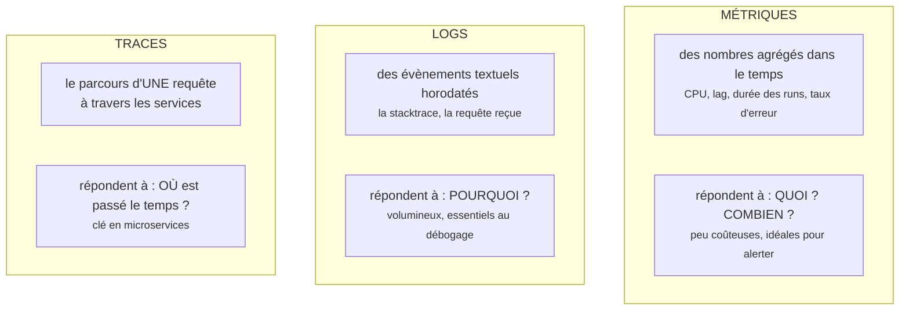
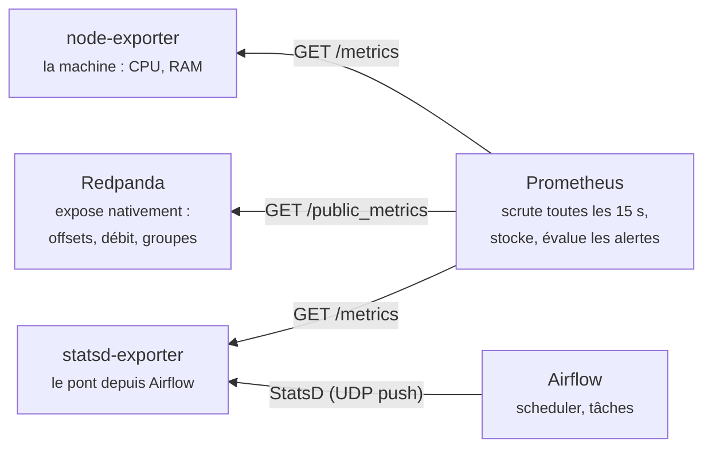
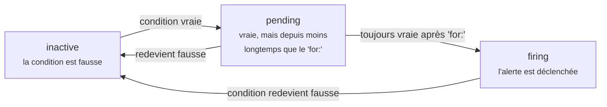

# Bloc 10 : Monitoring et observabilité (Prometheus, Grafana)

Ta plateforme est complète : ingestion, lake, warehouse, orchestration. Il
manque une chose, la plus importante en production : **savoir qu'elle va
bien, et savoir immédiatement quand elle va mal**. Ce bloc pose les concepts
de l'observabilité, puis branche Prometheus et Grafana sur tout ce que tu as
construit : la machine, Kafka et Airflow. Tu finiras par provoquer une vraie
panne et regarder l'alerte se déclencher.

## 1. Les trois piliers de l'observabilité

L'observabilité, c'est la capacité à répondre à « que se passe-t-il dans le
système ? » **sans y ajouter du code à chaque question**. Trois familles de
signaux y contribuent, complémentaires :



Le réflexe professionnel : l'**alerte** naît d'une métrique (« le taux
d'échec monte »), le **diagnostic** se fait dans les logs (« voilà la
stacktrace »), et la **trace** localise le coupable quand plusieurs services
se renvoient la balle. Ce bloc se concentre sur les métriques, le pilier
alertant ; tu utilises déjà les logs depuis le bloc 3 (`podman logs`,
logs des tâches Airflow).

## 2. Prometheus : le modèle mental

### Le pull : Prometheus vient chercher les métriques

Contre-intuitif mais fondamental : les applications ne poussent pas leurs
métriques. Chacune expose une simple page texte `/metrics`, et Prometheus
passe la **scruter** (*scrape*) à intervalle régulier :



Pourquoi le pull ? Parce que c'est **Prometheus qui sait** qui il surveille :
une cible qui ne répond plus est immédiatement détectée (métrique `up` à 0),
alors qu'en push, une application morte est juste... silencieuse. Va voir une
cible de tes yeux : `curl localhost:9644/public_metrics` (Redpanda), c'est du
texte lisible.

Trois façons d'exposer des métriques, toutes les trois dans notre stack :

| Cas | Exemple chez nous | Méthode |
|---|---|---|
| L'application le fait nativement | Redpanda | rien à faire, on scrute |
| L'application ne le fait pas | la machine Linux | un **exporter** dédié (node-exporter) |
| L'application parle un autre protocole | Airflow (StatsD) | un exporter-**pont** (statsd-exporter) |

### Séries temporelles et labels

Une métrique Prometheus est une **série temporelle** : un nom, des
**labels** (paires clé-valeur) et des points datés. Les labels sont toute la
puissance du modèle :

```
airflow_task_duration{dag_id="pipeline_commandes", task_id="dbt_run", quantile="0.99"}  14.2
redpanda_kafka_max_offset{redpanda_topic="commandes", redpanda_partition="1"}  499
```

Une même métrique se découpe par DAG, par tâche, par topic, par partition :
on agrège ensuite à la demande, dans les requêtes.

## 3. PromQL : les quatre gestes de base

PromQL est le langage de requête. Quatre gestes couvrent 90 % des besoins,
illustrés avec les requêtes **réellement utilisées** dans notre dashboard :

**1. Sélectionner** une série par nom et labels :

```promql
airflow_dagrun_duration_success{dag_id="pipeline_commandes", quantile="0.99"}
```

**2. Dériver un débit** d'un compteur qui ne fait que croître : `rate()`
(par seconde, lissé) et `increase()` (accroissement sur la fenêtre) :

```promql
sum(rate(redpanda_kafka_max_offset{redpanda_topic="commandes"}[5m]))
```

L'offset max ne fait que monter ; sa dérivée est le **débit de production**
en messages par seconde. C'est LE réflexe PromQL : un compteur brut ne
s'affiche jamais, on affiche sa vitesse.

**3. Agréger** avec `sum`, `avg`, `max`... et `by (label)` :

```promql
100 - (avg(rate(node_cpu_seconds_total{mode="idle"}[5m])) * 100)
```

Le CPU « utilisé » est calculé en creux : 100 moins la moyenne, sur tous les
cœurs, de la part de temps passée à ne rien faire.

**4. Combiner** deux séries arithmétiquement. Le lag du consumer, notre
requête la plus parlante :

```promql
sum(redpanda_kafka_max_offset{redpanda_topic="commandes"})
  - sum(redpanda_kafka_consumer_group_committed_offset{redpanda_group="archiveur-parquet"})
```

« Tout ce qui a été écrit » moins « tout ce que le groupe a lu » : le nombre
de messages en attente. Un lag qui grimpe sans redescendre est le symptôme
numéro un d'un pipeline streaming malade.

## 4. Grafana : voir, et faire voir

Prometheus stocke et calcule ; **Grafana** rend visible. Concepts :

- La **datasource** : la connexion vers Prometheus (il peut y en avoir
  plusieurs : Loki pour les logs, PostgreSQL...).
- Le **dashboard** : une grille de **panels**, chacun étant une requête
  PromQL plus une représentation (courbe, stat, jauge, tableau).
- Les **variables** : des listes déroulantes (`$dag_id`, `$topic`) qui
  paramètrent tout le dashboard ; un seul dashboard sert alors pour tous les
  DAGs ou tous les topics.

Point important de notre stack : datasource **et** dashboard sont
**provisionnés par fichiers** (`infra/monitoring/grafana/provisioning/`).
Personne ne clique pour reconstruire le monitoring : détruire et recréer le
conteneur Grafana redonne exactement le même résultat. C'est le principe
d'IaC du bloc 5 appliqué jusqu'au bout ; les dashboards se versionnent et se
relisent en pull request comme le reste.

## 5. L'alerting : des règles, pas de la vigilance

Personne ne regarde un dashboard à 3 h du matin. Une **règle d'alerte** est
une requête PromQL évaluée en continu ; quand elle devient vraie, l'alerte
s'active :

```yaml
- alert: DagRunEchoue
  expr: increase(airflow_dagrun_duration_failed_count[30m]) > 0
  labels:
    severity: critique
```

!!! bug "Le piège du premier échec (vécu en écrivant ce tutoriel)"
    Cette règle « évidente » ne détecte PAS le tout premier échec ! Tant
    qu'aucun run n'a jamais échoué, la série n'existe pas ; au premier
    échec elle **naît directement à 1**. `increase()` ne voit alors qu'une
    constante (aucun point antérieur dans sa fenêtre) : accroissement nul,
    alerte muette. Le remède est le motif `unless ... offset` : « la série
    existe maintenant mais n'existait pas il y a 30 minutes ». Regarde la
    version complète dans `prometheus/alerts.yml` : ses deux clauses
    couvrent le premier échec ET les suivants. Leçon générale : **teste
    toujours tes alertes en provoquant la panne**, c'est l'objet de
    l'exercice final.

Le cycle de vie d'une alerte :



La clause `for:` est l'anti-fausse-alerte : `LagConsumerEleve` exige 10
minutes de lag continu avant de sonner, un pic transitoire ne réveille
personne. (L'acheminement des notifications vers Slack ou l'email est le
travail d'un composant séparé, **Alertmanager**, hors périmètre du lab :
nous lirons les alertes dans l'interface de Prometheus.)

### SLI et SLO : alerter sur ce qui compte

Sur quoi mettre des alertes ? La réponse structurée de l'ingénierie de
fiabilité :

- Un **SLI** (*Service Level Indicator*) : une mesure qui reflète ce que
  les utilisateurs vivent. Pour un pipeline de données : « fraîcheur des
  tables au matin », « part des runs quotidiens réussis ».
- Un **SLO** (*Service Level Objective*) : l'engagement chiffré sur ce SLI :
  « les tables sont à jour avant 8 h, 99 % des jours du mois ».

La discipline : on alerte sur la **menace du SLO** (« le run de nuit a
échoué, la fraîcheur de 8 h est en danger »), pas sur chaque soubresaut
technique (« le CPU a fait un pic »). Nos trois règles suivent cette
logique : échec de run (le SLO de fraîcheur est menacé), lag durable (le
retard s'accumule), mémoire saturée (la machine va faire tomber le reste).

## 6. La stack du bloc

Les fichiers sont dans
[`infra/monitoring/`](https://github.com/menraromial/tuto-infra/tree/main/infra/monitoring) :

```
infra/monitoring/
├── compose.yaml                    # prometheus, node-exporter, statsd-exporter, grafana
├── prometheus/prometheus.yml       # qui scruter, à quelle fréquence
├── prometheus/alerts.yml           # les 3 règles d'alerte
├── statsd/mapping.yml              # noms StatsD d'Airflow -> métriques propres à labels
└── grafana/provisioning/           # datasource + dashboard, en fichiers versionnés
```

```bash
# Prérequis : stacks ingestion (bloc 6) et airflow (bloc 9) démarrées
cd infra/monitoring
podman compose up -d
```

Le compose raconte à lui seul la topologie : Prometheus est attaché au
réseau `ingestion` (pour scruter `redpanda:9644`), le statsd-exporter au
réseau `airflow` (pour recevoir l'UDP du scheduler). Côté Airflow, quatre
variables d'environnement activent l'émission (voir
`infra/airflow/compose.yaml`, section métriques) ; si tu viens du bloc 9,
reconstruis l'image et recrée les conteneurs :

```bash
podman build -t localhost/tuto-airflow:bloc9 infra/airflow/
cd infra/airflow && podman compose up -d
```

## 7. Accès aux interfaces web

### Prometheus : http://localhost:9095

Pas d'identifiants. (Port 9095 et non 9090, souvent déjà occupé.) À visiter :

- **Status → Target health** : les 4 cibles (airflow, machine, prometheus,
  redpanda) doivent être **UP**. Première vérification de tout problème.
- **Graph** : le laboratoire PromQL. Colle chaque requête de la section 3,
  bascule entre table et graphe, regarde les labels.
- **Alerts** : les 3 règles et leur état (inactive, pending, firing).

### Grafana : http://localhost:3001

Identifiants : `admin` / `grafana12345` (définis dans le compose).

- **Dashboards → Pipeline → « Santé du pipeline de données »** : le
  dashboard provisionné : CPU, RAM, échecs de runs, lag du consumer, débit
  du topic, durée des runs et durée par tâche.
- Passe en **Edit** sur un panel pour voir sa requête PromQL : chaque panel
  est une requête de la section 3.
- **Explore** (boussole) : requêtes ad-hoc sans dashboard, pratique pour
  chercher.

## Exercice final : le dashboard, et l'alerte qui sonne

### 1. Donner vie au dashboard

Génère de l'activité pour voir les courbes bouger :

```bash
cd exercices/bloc6 && .venv/bin/python producer.py --nombre 300
podman exec -e HOME=/home/airflow airflow-scheduler \
  airflow dags trigger pipeline_commandes
```

Pendant le run, observe : le **lag** monte à l'arrivée des 300 messages puis
retombe à 0 quand `archiver_kafka` les consomme ; la **durée du run** et la
durée par tâche s'inscrivent à la fin.

### 2. L'exercice incendie : provoquer la panne

On éteint MinIO et on déclenche le pipeline : la tâche `deposer_bronze` ne
pourra pas écrire.

```bash
podman stop minio
podman exec -e HOME=/home/airflow airflow-scheduler \
  airflow dags trigger pipeline_commandes
```

Suis la séquence en direct, elle met en scène tout le parcours :

1. **UI Airflow** (localhost:8093, vue Grid) : `archiver_kafka` passe au
   vert, puis `deposer_bronze` en orange `up_for_retry`, deux fois (nos
   `retries: 2` du bloc 9), puis rouge `failed` au bout d'environ 3 minutes.
2. **Prometheus → Alerts** : `DagRunEchoue` passe de inactive à **firing**
   dans la minute qui suit (la métrique `airflow_dagrun_duration_failed_count`
   vient d'augmenter).
3. **Grafana** : le stat « Échecs de runs DAG (24 h) » passe à 1.

### 3. Réparer et vérifier le retour à la normale

```bash
podman start minio
podman exec -e HOME=/home/airflow airflow-scheduler \
  airflow dags trigger pipeline_commandes
```

Le run repasse au vert (les tâches étant idempotentes, rejouer après panne
est sans danger : c'était tout l'objet des blocs 8 et 9), et l'alerte
retombe à inactive quand sa fenêtre de 30 minutes glisse au-delà de
l'incident.

**Critères de réussite** : les 4 cibles UP ; le dashboard montre le pic de
lag puis son retour à 0 ; tu as vu l'alerte passer inactive → firing →
inactive ; et tu sais expliquer chaque requête PromQL du dashboard.

## Aller plus loin : monitorer Kubernetes

Le cluster kind du bloc 3 s'observe avec les mêmes outils : **cAdvisor**
(intégré au kubelet) expose la consommation de chaque conteneur,
**kube-state-metrics** l'état des objets (pods en échec, deployments
incomplets), et la stack packagée `kube-prometheus-stack` s'installe en un
chart Helm (bloc 3, again). Le principe ne change pas d'un iota : des
exporters, un scrape, du PromQL. Si tu veux un défi : installe-la sur le
cluster kind et ajoute un panel « pods non prêts » au dashboard.

## Dépannage

??? failure "Une cible est DOWN dans Status → Target health"
    - `redpanda` : la stack ingestion tourne-t-elle ? Prometheus est-il
      bien attaché au réseau `ingestion_default` (compose) ?
    - `airflow` (statsd-exporter) : la stack monitoring a-t-elle démarré
      après la stack airflow (le réseau externe doit exister) ?
    - `machine` : le conteneur node-exporter tourne-t-il ?

??? failure "Les métriques airflow_* n'apparaissent pas dans Prometheus"
    - Les variables `AIRFLOW__METRICS__STATSD_*` sont-elles dans le compose
      d'Airflow, et les conteneurs recréés depuis (`podman compose up -d`) ?
    - L'image contient-elle la bibliothèque `statsd` (Containerfile) ?
    - Déclenche un run : la plupart des métriques n'existent qu'après une
      première émission.

??? failure "Le dashboard Grafana est vide ou en « No data »"
    - La datasource répond-elle ? Connections → Data sources → Prometheus →
      « Save & test ».
    - Certains panels n'ont de données qu'après un run réussi (durées) ou
      un échec (compteur d'échecs) : c'est normal au premier démarrage.
    - Modifie l'intervalle de temps (en haut à droite) : nos métriques
      n'existent que depuis le démarrage de la stack.

??? failure "node-exporter ne démarre pas : erreur de montage de /"
    En Podman rootless, le montage de la racine hôte est interdit : notre
    compose lance node-exporter **sans** ce montage. CPU et RAM restent
    corrects (/proc n'est pas isolé), les métriques de disque refléteraient
    le conteneur : documenté, assumé pour un lab.

??? failure "L'alerte ne se déclenche pas après l'échec du run"
    - Le run est-il vraiment `failed` (UI Airflow) ? Les retries prennent
      environ 3 minutes avant l'échec définitif.
    - Interroge la métrique à la main dans Prometheus → Graph :
      `airflow_dagrun_duration_failed_count`. Absente ? Le problème est en
      amont (statsd), vois la question précédente.
    - L'évaluation a lieu toutes les 15 s : patiente une minute.
