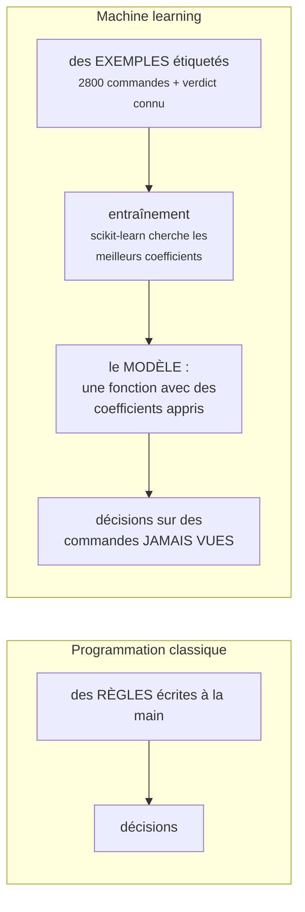
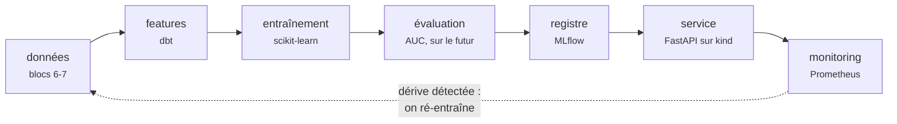
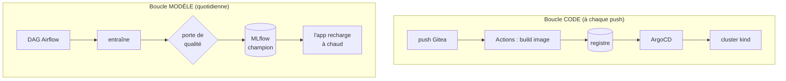
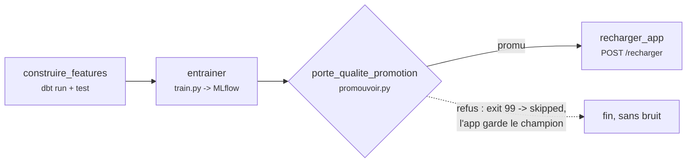

# Bloc 11 : Projet MLOps, du modèle au déploiement continu

Le projet de couronnement : un **détecteur de commandes suspectes** pour la
boutique, mené des données brutes jusqu'à une application web en production
sur le cluster, avec ré-entraînement automatique quotidien. Ce bloc n'ajoute
presque aucun outil : il **assemble** tout ce que tu as construit aux blocs
3 à 10. C'est exactement ce qu'est le MLOps : du data engineering et du
DevOps appliqués aux modèles.

**Prérequis** : la plateforme complète en marche (cluster kind + ArgoCD,
Gitea + runner, ingestion, lake, Airflow, monitoring). Compte 8 Go de RAM
libres ; ferme les stacks inutilisées (LocalStack...) avant de commencer.

## 1. Le problème métier (avant toute technique)

La boutique des blocs 6-10 reçoit des milliers de commandes. Certaines sont
frauduleuses : quantités de razzia à revendre, prix manipulés. Aucun analyste
ne peut relire chaque commande ; il faut donc **prioriser** : donner à chaque
commande un score de risque, et ne faire vérifier par des humains que
celles au-dessus d'un seuil. C'est exactement le rôle du modèle de ce bloc :
un outil d'aide à la décision, pas un juge.

## 2. C'est quoi, un modèle de machine learning ?

Si c'est ton premier contact avec le ML, lis cette section deux fois : tout
le reste du bloc en découle.

### Une fonction apprise, pas programmée

Pour détecter la fraude, l'approche classique serait d'écrire des règles à
la main : « si quantité > 20 alors suspect ». Fragile : il faut deviner les
seuils, les combiner, les maintenir. Le machine learning inverse la
démarche : on fournit des **exemples étiquetés** (2800 commandes dont on
sait, a posteriori, lesquelles étaient frauduleuses), et l'algorithme
**apprend la règle tout seul**.



Notre modèle est une **régression logistique**, le plus simple qui soit :
une somme pondérée des 4 features, passée dans une fonction qui écrase le
résultat entre 0 et 1 :

```
score = sigmoide( a*quantite + b*montant + c*ratio_prix + d*commandes_jour + e )
```

« Entraîner », c'est chercher les valeurs de `a, b, c, d, e` qui collent le
mieux aux 2800 exemples. « Prédire », c'est appliquer cette formule à une
commande nouvelle : un simple calcul, en microsecondes. Le score est une
**probabilité de fraude** : 0.02 = presque sûrement normale, 0.97 = très
suspecte ; au-dessus de 0.5, l'app affiche le verdict « suspecte ».

!!! question "À quel moment une commande est-elle considérée frauduleuse ?"
    Distingue bien deux moments et deux mots :

    1. **« Frauduleuse », c'est la réalité.** Dans notre lab, elle est
       décidée à la génération : le producer tire au sort ~5 % de commandes
       et leur donne un comportement de fraude (quantité de razzia 20-60,
       ou prix à 3-15 % du catalogue), avec le champ `signalement_fraude`
       qui simule le signalement **a posteriori** (litige, analyste).
       C'est le label d'entraînement ; le modèle ne le voit jamais au
       moment de prédire.
    2. **« Suspecte », c'est le jugement du modèle.** À la prédiction,
       l'app applique un seuil : score >= 0.5 donne le verdict
       « suspecte ». Le modèle n'utilise aucune règle écrite : il a appris
       des exemples que prix cassés, quantités énormes et rafales de
       commandes ressemblent aux commandes signalées.

    Le système ne déclare donc jamais une fraude : il **signale une
    suspicion**, qui peut être fausse dans les deux sens. Et le seuil de
    0.5 est un **choix métier** : l'abaisser attrape plus de fraudes mais
    dérange plus de clients honnêtes ; le remonter fait l'inverse. En
    production, on le règle selon le coût relatif des deux erreurs.

### À quoi ressemble un modèle, physiquement ?

À un **fichier**. Après l'entraînement, scikit-learn sérialise l'objet
(les coefficients appris et la recette de normalisation) dans un fichier de
quelques kilo-octets. C'est cet **artefact** que MLflow range dans MinIO,
que l'application télécharge et garde en mémoire. Va le voir de tes yeux :
console MinIO (localhost:9001) → bucket `mlflow` → le dossier d'un run →
`model.pkl`. Tout le MLOps consiste à gérer le cycle de vie de ce petit
fichier avec le même sérieux que du code.

## 3. Le cycle de vie d'un modèle

Un modèle de ML n'est pas un livrable figé, c'est un **produit périssable** :
les données changent, le monde change, le modèle d'hier se dégrade. D'où un
cycle, pas une ligne :



### La leçon MLOps numéro un : deux cycles de vie séparés

Le **code** de l'application et le **modèle** qu'elle sert n'évoluent pas au
même rythme ni pour les mêmes raisons. Notre architecture les découple
totalement :



Un nouveau modèle ne déclenche **aucun** rebuild d'image ; un correctif de
code ne ré-entraîne rien. Chaque boucle a sa validation (revue de PR d'un
côté, porte de qualité de l'autre) et son mécanisme de retour arrière
(revert Git, bascule d'alias MLflow).

## 4. Le projet et ses données

Le producer du bloc 6 accepte désormais `--anomalies 0.05` : 5 % des
commandes sont frauduleuses (quantités de razzia, prix cassés), et portent
un champ `signalement_fraude` qui simule le signalement **a posteriori**
(analyste, litige client) : c'est notre **label**. L'application de scoring,
elle, ne reçoit jamais ce champ : elle doit le *prédire*.

Les **features** sont calculées en SQL par dbt
(`models/marts/features_commandes.sql`) : quantité, montant, ratio du prix
au prix médian du produit, nombre de commandes du client dans la journée.

!!! note "Pourquoi des features en SQL ?"
    Le service de production recalcule les mêmes features à la volée. Si
    l'entraînement et le service calculent différemment, le modèle reçoit en
    production des données qu'il n'a jamais vues : c'est le
    **training/serving skew**, une des premières causes de modèles qui
    « marchaient pourtant en notebook ». Une logique simple, en SQL lisible,
    minimise ce risque.

!!! warning "Honnêteté pédagogique : l'AUC de 1.0"
    Nos fraudes synthétiques sont volontairement grossières, le modèle les
    sépare parfaitement (AUC = 1.0). Un vrai problème de fraude est
    beaucoup plus dur. Ce bloc enseigne la **tuyauterie** qui entoure le
    modèle : c'est elle qui manque le plus souvent en entreprise, pas
    l'algorithme.

## 5. MLflow : la mémoire et le registre des modèles

Sans outillage, les modèles s'appellent `model_final_v2_VRAI.pkl`,
traînent sur des postes de travail, et personne ne sait lequel tourne en
production ni avec quelles données il a été entraîné. **MLflow** est
l'outil standard qui résout ce chaos. Retiens l'image : un **cahier
d'expériences** et une **étagère de modèles**.

- Le cahier (**tracking**) : chaque entraînement y consigne tout : quand,
  avec quels réglages, sur combien de lignes, pour quel score. Six mois
  plus tard, on peut répondre à « pourquoi ce modèle décide-t-il ça ? ».
- L'étagère (**registre**) : chaque fichier-modèle y est rangé avec un
  numéro de version, et une étiquette `champion` désigne celui que la
  production doit servir. Déployer un modèle = déplacer l'étiquette.

Plus précisément :

- Le **tracking** : chaque exécution d'entraînement (un *run*) enregistre
  ses paramètres, ses métriques et ses artefacts (le modèle sérialisé,
  stocké chez nous... dans MinIO, le lake du bloc 7).
- Le **registre** : un modèle nommé (`score-risque`) avec des **versions**
  (1, 2, 3...) et des **alias**. L'alias `champion` désigne LA version en
  production. Promouvoir = déplacer l'alias ; revenir en arrière = pareil,
  en un geste.

Le service ne connaît qu'une seule chose : `models:/score-risque@champion`.
Qui est champion, c'est le registre qui le dit : le déploiement d'un modèle
devient un **changement de pointeur**, pas un déploiement logiciel.

```bash
podman build -t localhost/tuto-mlflow:bloc11 infra/mlflow/
cd infra/mlflow && podman compose up -d
```

### L'interface web de MLflow : http://localhost:5002

Aucun identifiant. À explorer :

- **Experiments → score-risque** : un run par entraînement ; clique-en un
  pour voir paramètres, métriques et artefacts. Coche deux runs puis
  **Compare** : le tableau comparatif des AUC, l'outil de discussion d'une
  équipe ML.
- **Models → score-risque** : les versions, et l'alias `champion` qui
  matérialise « ce qui est en production ».

## 6. Entraîner, évaluer, promouvoir

Deux scripts dans `exercices/bloc11/entrainement/`, à lire avant de lancer :

- **`train.py`** : charge les features (connexion DuckDB *read-only* : pas
  de conflit de verrou avec dbt), découpe **temporellement** (on s'évalue
  sur le futur, jamais sur un mélange : sinon score optimiste), entraîne une
  régression logistique avec `class_weight="balanced"` (5 % de fraudes :
  sans ce réglage, prédire « tout va bien » donne 95 % de précision et zéro
  utilité), et enregistre tout dans MLflow.
- **`promouvoir.py`** : la **porte de qualité**. Deux conditions : AUC au
  moins égale au seuil absolu (0.90), et au moins égale à celle du champion
  en place. Si refus, le script sort avec le **code 99** : dans Airflow, la
  tâche passera en *skipped*, pas en échec : un candidat médiocre n'est pas
  un incident, c'est un non-évènement qui ne réveille personne.

```bash
cd exercices/bloc11/entrainement
python3 -m venv .venv && .venv/bin/pip install -r requirements.txt
.venv/bin/python train.py        # auc=1.0000 ... enregistré dans MLflow
.venv/bin/python promouvoir.py   # PROMU : la version 1 est le nouveau champion
```

## 7. Le service : une petite app web en production

`exercices/bloc11-app/` est un dépôt applicatif complet, comme
`bloc4-app` : FastAPI (`main.py`), Dockerfile, manifests `deploy/`, workflow
CI. Les points à lire dans `main.py` :

- au démarrage, il charge `models:/score-risque@champion` depuis MLflow ;
- `POST /predire` recalcule les features d'une commande saisie et renvoie
  score + verdict + **version du modèle** (la traçabilité jusqu'à
  l'utilisateur) ;
- `POST /recharger` recharge le champion **à chaud** : c'est le crochet que
  le DAG appelle après une promotion : nouveau modèle en service sans
  rebuild ni redéploiement ;
- `GET /metrics` expose les métriques Prometheus du bloc 10 (compteur par
  verdict, histogramme des scores, latence).

Déploiement : le chemin exact du bloc 4, rien de neuf à apprendre :

```bash
# dépôt Gitea "bloc11-app" (public) + secret REGISTRY_PASSWORD, puis :
cd exercices/bloc11-app
git init -b main && git add -A && git commit -m "feat: app de score de risque"
git remote add origin http://gitea:3000/admin/bloc11-app.git
git push -u origin main            # CI : build + push + commit GitOps

kubectl apply -f infra/argocd/bloc11-app.yaml   # ArgoCD prend le relais
```

### À quoi sert le formulaire, et comment l'utiliser

Dans la vraie vie, personne ne saisit les commandes dans un formulaire : le
site e-commerce appellerait `POST /predire` automatiquement à chaque
commande, et déciderait (bloquer, demander une vérification, laisser
passer) selon le score. Le formulaire est la **vitrine de démonstration**
qui te fait jouer le rôle du site marchand.

Mode d'emploi, sur **http://localhost:8088** (le NodePort 30080, libéré de
l'exercice du bloc 3 : `kubectl delete namespace bloc3`) :

1. **Produit** : le choix fixe le prix « normal » de référence.
2. **Quantité** et **prix unitaire** : les valeurs de la commande à
   évaluer. Le modèle comparera ce prix au prix normal (le `ratio_prix`).
3. **Commandes de ce client aujourd'hui** : simule l'historique récent du
   client (une rafale de commandes est un signal de fraude).
4. Clique **Évaluer la commande** : le score (en %), le verdict, et la
   **version du modèle** qui a répondu s'affichent.

Essaie ces deux scénarios et observe la bascule :

| Scénario | Saisie | Résultat attendu |
|---|---|---|
| Client ordinaire | 2 claviers à 49,90, 1re commande du jour | score ~0 %, NORMALE |
| Razzia à prix cassé | 45 écrans à 15,00 (au lieu de 179), 9e commande | score ~100 %, SUSPECTE |

L'équivalent de ce que ferait le site marchand, en ligne de commande :

```bash
curl -X POST http://localhost:8088/predire -H 'Content-Type: application/json' \
  -d '{"produit":"ecran","quantite":45,"prix_unitaire":15.0,"commandes_client_jour":9}'
# {"score":1.0,"verdict":"suspecte","version_modele":"3"}
```

## 8. Le ré-entraînement orchestré

Le DAG `entrainement_score_risque` (dans `exercices/bloc11/dags/`) boucle la
boucle modèle, chaque jour :



Remarque le `skip_on_exit_code=99` sur la porte : la distinction
échec/refus, en une ligne, évite de polluer l'alerte `DagRunEchoue` du
bloc 10. Et chaque tâche reste idempotente : rejouer le DAG entraîne un
modèle de plus, la porte décide, l'état final est le même.

Côté réseau, une subtilité à repérer dans `infra/airflow/compose.yaml` : le
scheduler est attaché au réseau **kind** pour joindre l'app
(`tuto-control-plane:30080`), et `MLFLOW_TRACKING_URI` pointe sur
`mlflow:5000` via le réseau lake.

## 9. Le monitoring du modèle : la dérive

Un modèle en production se dégrade en silence : le monde change
(**dérive des données** : les entrées ne ressemblent plus à l'entraînement)
ou la relation change (**dérive de concept** : les fraudeurs s'adaptent).
Aucune stacktrace, aucun crash : seul le **monitoring statistique** la voit.

Notre indicateur : la **part de commandes jugées suspectes**. En régime
normal, ~5 % (le taux d'anomalies du producer). La règle Prometheus
`DeriveScoreRisque` alerte si elle dépasse 20 % pendant plusieurs minutes :
un modèle qui crie au loup sur un cinquième du trafic ne signale pas une
vague de fraude, il signale que **les données ont changé**.

Dans Grafana : le dashboard **« Modèle de score de risque (bloc 11) »**
(part de suspectes, prédictions par verdict, score moyen, latence p95).
En production réelle on surveillerait aussi la distribution de chaque
feature (le PSI, *Population Stability Index*) : retiens le principe,
l'outillage est le même.

## Exercice final : la dérive, vécue de bout en bout

1. **Régime normal** : quelques prédictions via le formulaire, la part de
   suspectes reste basse dans Grafana.
2. **Le monde change** : envoie un trafic biaisé (une boucle de `curl` avec
   ~50 % de commandes anormales, ou le producer avec `--anomalies 0.5` puis
   le DAG d'ingestion).
3. **L'alerte parle** : dans Prometheus → Alerts, `DeriveScoreRisque` passe
   pending puis **firing** en quelques minutes ; le stat Grafana vire au
   rouge.
4. **La plateforme s'adapte, seule** : le prochain run du DAG de
   ré-entraînement apprend sur les données récentes, la porte de qualité
   tranche, et si un nouveau champion est promu, l'app le sert dans la
   minute (vérifie `version_modele` dans une réponse de `/predire`).

**Critères de réussite** : tu sais raconter le trajet aller (une commande
saisie → features → modèle → verdict) ET le trajet retour (données qui
changent → alerte → ré-entraînement → nouveau champion → app rechargée),
en nommant l'outil de chaque étape, et en montrant que **personne n'a
poussé de code ni reconstruit d'image** pendant tout le cycle modèle.

## Dépannage

??? failure "L'app crashe au démarrage : `Invalid Host header - possible DNS rebinding attack`"
    MLflow 3 n'accepte que les en-têtes Host de sa liste blanche. Le
    compose de `infra/mlflow/` définit `MLFLOW_SERVER_ALLOWED_HOSTS` avec
    les deux noms utilisés (`localhost:5002` et `mlflow:5000`) : si tu
    changes un port ou un nom de service, mets cette liste à jour.

??? failure "`ImagePullBackOff` : `dial tcp 127.0.0.1:3000`"
    Le piège du `/etc/hosts` recopié dans le nœud kind : voir le dépannage
    du bloc 4 (et `create-cluster.sh` qui purge l'entrée à la création).

??? failure "La machine rame, des conteneurs meurent (OOM)"
    Le bloc 11 fait tourner presque toute la plateforme : 8 Go libres sont
    nécessaires. Arrête ce qui ne sert pas : LocalStack (bloc 5), les
    conteneurs srv1/srv2, les consoles Adminer et Redpanda Console.
    Symptôme classique après un épisode mémoire : des ports publiés qui ne
    répondent plus (`HTTP 000`) alors que les conteneurs sont « Up » :
    redémarre les conteneurs concernés. Et regarde l'alerte
    `MemoireSaturee` du bloc 10 : elle était là pour ça.

??? failure "Le Service refuse de se créer : `nodePort: Invalid value: 30080: provided port is already allocated`"
    Le NodePort est encore tenu par l'exercice du bloc 3 :
    `kubectl delete namespace bloc3`, puis relance la synchronisation
    ArgoCD (le sync automatique cesse de réessayer après 5 échecs :
    Details → Sync dans l'UI, ou
    `kubectl -n argocd patch application bloc11-app --type merge -p '{"operation":{"sync":{"revision":"main"}}}'`).

??? failure "Le DAG réussit mais l'app sert l'ancienne version"
    - La tâche `porte_qualite_promotion` est-elle *skipped* ? Alors le
      candidat a été refusé : c'est le comportement voulu, regarde ses logs.
    - Sinon, vérifie l'alias dans MLflow (Models → score-risque) puis
      appelle `POST /recharger` à la main et compare `version_modele`.

??? failure "L'entraînement échoue : `Conflicting lock` sur warehouse.duckdb"
    Comme au bloc 9 : un CLI `duckdb` ouvert sur le fichier côté hôte.
    `train.py` ouvre la base en lecture seule, mais dbt (la tâche d'avant)
    a besoin du verrou d'écriture.
