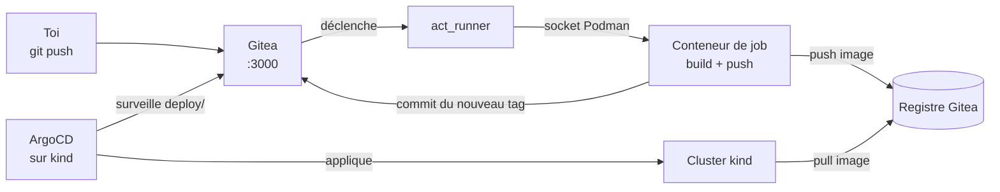

# Bloc 4 : CI/CD avec Gitea Actions et ArgoCD (auto-hébergés)

Objectif du bloc : comprendre l'anatomie d'un pipeline CI/CD **et** le principe
GitOps en hébergeant ta propre forge Git, son runner, son registre d'images et
ArgoCD, le tout en local sur Podman.

**Prérequis** : le bloc 3 terminé (cluster kind `tuto` en marche, script
`scripts/setup-hote.sh` exécuté).

!!! note "Pourquoi Gitea plutôt que GitHub Actions ?"
    - **Gitea Actions utilise la même syntaxe** que GitHub Actions
      (`on:`, `jobs:`, `steps:`, `uses: actions/checkout@v4`…) : tout ce que
      tu apprends ici est directement transposable.
    - Tout tourne **en local sur Podman** : pas de quota de minutes, pas de
      compte externe, et tu vois fonctionner les deux côtés (le serveur ET le
      runner), ce qu'un service SaaS te cache.
    - Gitea intègre un **registre de conteneurs** : il remplace Docker Hub
      pour l'exercice final.

## Architecture complète du bloc



La boucle GitOps : le pipeline CI **ne déploie jamais lui-même**. Il pousse
l'image, puis écrit le nouveau tag **dans Git**. ArgoCD, qui surveille le
dépôt, constate l'écart entre Git (état voulu) et le cluster (état réel), et
synchronise. Git reste l'unique source de vérité.

## 1. Les trois problèmes de réseau (et leurs solutions)

Un environnement auto-hébergé expose des questions que le SaaS masque.
Trois acteurs doivent joindre Gitea, chacun par un chemin différent :

| Qui | Comment il joint Gitea | Solution |
|---|---|---|
| Ton navigateur, ton `podman push` | `gitea:3000` | entrée `127.0.0.1 gitea` dans `/etc/hosts` (fait par `setup-hote.sh`) |
| Les conteneurs de jobs CI | `http://gitea:3000` | `container.network: gitea` dans la config du runner |
| Les nœuds kind (pull d'images, ArgoCD) | `gitea:3000` | le conteneur Gitea est **attaché au réseau `kind`** (cf. `compose.yaml`) |

De plus, le registre est en **HTTP** (pas de TLS en local) : il faut le
déclarer « insecure » des deux côtés qui tirent des images :

```bash
# Côté Podman de l'hôte (utilisé aussi par les jobs CI via la socket) :
mkdir -p ~/.config/containers
cp infra/podman/registries.conf ~/.config/containers/registries.conf

# Le service API Podman garde l'ancienne config en cache : le relancer
# (la socket, elle, ne bouge pas : les conteneurs ne sont pas affectés).
systemctl --user restart podman.service
```

Côté containerd des nœuds kind, c'est le fichier `hosts.toml` posé par
`infra/kind/create-cluster.sh` (bloc 3) qui s'en charge.

## 2. La stack compose

Les fichiers sont dans [`infra/gitea/`](https://github.com/menraromial/tuto-infra/tree/main/infra/gitea) :
`compose.yaml` (Gitea + runner) et `runner-config.yaml`. Points importants :

- `GITEA__server__ROOT_URL: http://gitea:3000/` : toutes les URLs (clones,
  service de tokens du registre) utilisent ce nom, résolu partout (cf. §1).
- `GITEA__security__INSTALL_LOCK: "true"` saute l'assistant d'installation
  web ; l'admin est créé en ligne de commande (étape 4).
- Le service `gitea` est attaché à **deux réseaux** : `gitea` (stack CI) et
  `kind` (celui du cluster, déclaré `external`).
- Le runner monte la **socket Podman** (`$XDG_RUNTIME_DIR/podman/podman.sock`)
  **au même chemin que sur l'hôte**, et `container.docker_host` (dans
  `runner-config.yaml`) pointe vers ce chemin. Subtilité importante : quand le
  runner transmet la socket aux conteneurs de jobs, la source du bind-mount
  est résolue **côté hôte**, le chemin doit donc être celui de l'hôte, sinon
  les jobs héritent d'une mauvaise socket (`permission denied` au
  `docker build`).

!!! warning "La socket = les clés du camion"
    Monter la socket Podman dans le runner donne aux jobs le contrôle total de
    ton Podman. C'est acceptable pour un lab local mono-utilisateur ; en
    production on utilise des runners isolés (VM, Kubernetes, DinD).

## 3. Démarrer Gitea

```bash
cd infra/gitea
podman compose up -d gitea
podman ps --filter name=gitea   # attendre "(healthy)"
```

## 4. Créer l'admin et enregistrer le runner

Le runner a besoin d'un **token d'enregistrement** généré par Gitea, d'où le
démarrage en deux temps :

```bash
# 1. Compte administrateur (choisis ton propre mot de passe)
podman exec -u git gitea gitea admin user create --admin \
  --username admin --password 'TON_MOT_DE_PASSE' \
  --email toi@example.com --must-change-password=false

# 2. Token d'enregistrement du runner → fichier .env lu par compose
echo "GITEA_RUNNER_REGISTRATION_TOKEN=$(podman exec -u git gitea \
  gitea actions generate-runner-token)" > .env

# 3. Démarrage du runner
podman compose up -d runner
podman logs gitea-runner
```

Le log doit contenir `Runner registered successfully.` puis
`declare successfully` avec le label `ubuntu-latest`. Le runner est aussi
visible dans **Administration → Actions → Runners** sur
[http://gitea:3000](http://gitea:3000).

!!! danger "Le fichier `.env` contient des secrets"
    Il est ignoré par Git (voir `.gitignore`). Ne le versionne jamais.

## 5. Premier pipeline (échauffement)

Crée un dépôt `hello-ci` (coche « Initialiser le dépôt »), puis ajoute le
fichier `.gitea/workflows/ci.yml` :

```yaml
name: ci
on: [push]
jobs:
  hello:
    runs-on: ubuntu-latest
    steps:
      - name: Checkout
        uses: actions/checkout@v4
      - name: Salut
        run: |
          echo "Gitea Actions fonctionne sur Podman !"
          cat README.md
```

Dès le commit, l'onglet **Actions** du dépôt montre le run. Le premier run
télécharge l'image de job (~1 Go) : compte quelques minutes, les suivants sont
immédiats. À noter : le chemin est `.gitea/workflows/` (et non
`.github/workflows/`), mais le contenu est du GitHub Actions standard.

## 6. Le registre de conteneurs

### C'est quoi, un registre ?

Un **registre de conteneurs** est un serveur qui stocke et distribue des
images, versionnées par tags. Quand tu tapes `podman pull nginx`, l'image est
téléchargée depuis un registre (Docker Hub par défaut). Docker Hub, ghcr.io
(GitHub), quay.io (Red Hat) sont des registres publics hébergés ; ici on veut
le nôtre, en local, pour que le pipeline y pousse ses images.

Le nom complet d'une image encode d'ailleurs le registre :

```
gitea:3000  /  admin  /  bloc4-app  :  v1
registre       espace     nom          tag
```

### Où est le nôtre ? (rien à installer)

**Gitea intègre un registre** : il est actif d'office, à la même adresse que
la forge (`gitea:3000`), avec les comptes Gitea comme authentification. Il n'y
a donc rien à créer ni à configurer, c'est l'un des intérêts de Gitea pour un
lab. (Sans Gitea, on aurait déployé l'image officielle `registry:2`, un
conteneur de plus.) Seule contrainte, déjà réglée au §1 : il est en HTTP, il
faut donc le déclarer « insecure » côté clients.

### Le tester à la main (avant de l'automatiser)

```bash
podman pull docker.io/library/alpine:3.21

# Renommer l'image au format du registre :
podman tag docker.io/library/alpine:3.21 gitea:3000/admin/demo:v1

# S'authentifier puis pousser :
podman login gitea:3000        # utilisateur admin + ton mot de passe
podman push gitea:3000/admin/demo:v1

# Vérifier : la liste des tags via l'API du registre...
curl -u admin:TON_MOT_DE_PASSE http://gitea:3000/v2/admin/demo/tags/list
# {"name":"admin/demo","tags":["v1"]}

# ...et le chemin inverse :
podman rmi gitea:3000/admin/demo:v1
podman pull gitea:3000/admin/demo:v1
```

Les images poussées apparaissent dans l'onglet **Paquets** du compte dans
l'interface web de Gitea. C'est exactement ce que fera le pipeline de
l'exercice final, à ceci près qu'il passera par la socket Podman (avec une
subtilité d'authentification, voir le dépannage).

## 7. Installer ArgoCD sur le cluster kind

```bash
kubectl create namespace argocd
kubectl apply --server-side -n argocd \
  -f https://raw.githubusercontent.com/argoproj/argo-cd/stable/manifests/install.yaml
kubectl -n argocd wait --for=condition=available deployment --all --timeout=300s
```

!!! bug "Pourquoi `--server-side` ?"
    Le CRD `ApplicationSet` dépasse la limite de 256 Ko de l'annotation
    `last-applied-configuration` du apply classique. Le *server-side apply*
    n'utilise pas cette annotation.

### Accéder à l'interface web d'ArgoCD

L'interface n'est pas exposée par défaut : on ouvre un tunnel avec
`port-forward` (à laisser tourner dans un terminal, `Ctrl+C` pour l'arrêter).

```bash
# 1. Mot de passe initial du compte "admin" :
kubectl -n argocd get secret argocd-initial-admin-secret \
  -o jsonpath='{.data.password}' | base64 -d; echo

# 2. Tunnel vers l'interface :
kubectl -n argocd port-forward svc/argocd-server 8443:443
```

Ouvre ensuite **https://localhost:8443** : le certificat est auto-signé, le
navigateur affiche un avertissement (« Avancé » puis « Continuer vers le
site »). Connexion avec `admin` et le mot de passe affiché à l'étape 1. Tu y
verras chaque application avec son arbre de ressources (Deployment,
ReplicaSet, Pods) et son état de synchronisation.

Arrêter le tunnel ne touche pas ArgoCD : il continue de tourner et de
synchroniser dans le cluster, le tunnel ne sert qu'à ton navigateur.

## Exercice final : la boucle GitOps complète

Un push sur le dépôt applicatif doit, sans aucune intervention manuelle :
construire l'image, la pousser sur le registre Gitea, et se retrouver déployé
sur le cluster. La solution complète est dans
[`exercices/bloc4-app/`](https://github.com/menraromial/tuto-infra/tree/main/exercices/bloc4-app) :

```
exercices/bloc4-app/
├── main.py                      # app Flask qui affiche son commit (version)
├── Dockerfile                   # ARG GIT_SHA → l'app sait quelle version elle est
├── deploy/                      # manifests surveillés par ArgoCD
│   ├── deployment.yaml          #   le tag d'image est réécrit par le CI
│   └── service.yaml             #   NodePort 30081 → localhost:8089
└── .gitea/workflows/cicd.yml    # build → push → mise à jour du manifest
```

### 1. Créer le dépôt applicatif dans Gitea

Dans l'interface : nouveau dépôt **public** `bloc4-app` (sans initialisation),
puis dans **Paramètres → Actions → Secrets**, ajoute le secret
`REGISTRY_PASSWORD` (le mot de passe du compte qui pousse sur le registre).

Pousse ensuite le contenu :

```bash
cd exercices/bloc4-app
git init -b main && git add -A && git commit -m "feat: app + pipeline"
git remote add origin http://gitea:3000/admin/bloc4-app.git
git push -u origin main
```

### 2. Lire le pipeline (le cœur du bloc)

!!! question "Pourquoi la commande `docker` et pas `podman` dans le pipeline ?"
    Le job s'exécute dans le conteneur `catthehacker/ubuntu`, qui embarque le
    **client** `docker` (et pas podman). Un client ne construit rien
    lui-même : il envoie des requêtes à un démon via une socket. Or la socket
    montée dans le job est celle de **Podman**, qui implémente l'API Docker.
    La commande s'appelle donc `docker`, mais c'est bien ton Podman qui
    construit et pousse les images. Bonus pédagogique : ce workflow est
    copiable tel quel sur GitHub Actions, où la même commande parlera cette
    fois à un vrai démon Docker.

Ouvre `.gitea/workflows/cicd.yml` et repère les trois étapes :

1. **Build** : `docker build --build-arg GIT_SHA=$TAG …` : le job parle au
   Podman de l'hôte via la socket. `DOCKER_BUILDKIT=0` force le builder
   classique, car Podman n'implémente pas BuildKit.
2. **Push** : les identifiants sont écrits directement dans
   `~/.docker/config.json` (pas de `docker login`, voir le dépannage), puis
   `docker push` les transmet au démon.
3. **GitOps** : `sed` réécrit le tag dans `deploy/deployment.yaml`, commit et
   push avec le message `[skip ci]`, sinon ce commit relancerait le pipeline
   à l'infini. Le pipeline ne touche **jamais** au cluster.

### 3. Brancher ArgoCD sur le dépôt

L'Application ArgoCD est décrite dans
[`infra/argocd/bloc4-app.yaml`](https://github.com/menraromial/tuto-infra/blob/main/infra/argocd/bloc4-app.yaml) :
elle surveille `deploy/` sur `http://gitea:3000/admin/bloc4-app.git` et
synchronise automatiquement (`automated`, `prune`, `selfHeal`,
`CreateNamespace`).

```bash
kubectl apply -f infra/argocd/bloc4-app.yaml
kubectl -n argocd get application bloc4-app   # attendre Synced / Healthy
```

ArgoCD re-lit le dépôt toutes les ~3 minutes ; pour forcer immédiatement :

```bash
kubectl -n argocd annotate application bloc4-app \
  argocd.argoproj.io/refresh=normal --overwrite
```

### 4. Vérifier la boucle complète

```bash
curl -s http://localhost:8089/
# {"app":"bloc4-app","message":"Déployé automatiquement par ArgoCD !","version":"<sha>"}
```

Le `version` doit être le SHA court du dernier commit applicatif. Maintenant,
**modifie le message** dans `main.py`, commit, push… et observe : run CI dans
Gitea → nouveau commit `deploy: … [skip ci]` → ArgoCD passe `OutOfSync` puis
`Synced` → `curl localhost:8089` montre le nouveau message et le nouveau SHA.

**Critère de réussite** : un simple `git push` change ce que répond
`localhost:8089`, sans qu'aucun humain n'ait touché ni au registre ni au
cluster.

## Récapitulatif des accès navigateur

| Service | URL | Identifiants |
|---|---|---|
| Gitea (forge, runs CI, registre) | http://gitea:3000 | `admin` + ton mot de passe |
| ArgoCD | https://localhost:8443 (via `port-forward`, voir plus haut) | `admin` + secret initial |
| Application du bloc 4 (`bloc4-app`) | http://localhost:8089 | aucun |
| Application du bloc 3 (API + PostgreSQL) | http://localhost:8088 | aucun |

Dans Gitea, l'onglet **Actions** d'un dépôt montre les runs du pipeline avec
leurs logs, et l'onglet **Paquets** du compte liste les images poussées sur le
registre. Les deux applications sont en NodePort : les ports 8088 et 8089
sont mappés par la config kind (`infra/kind/cluster.yaml`), aucun tunnel
n'est nécessaire.

## Dépannage

??? failure "Le job échoue : `Cannot connect to the Docker daemon`"
    La socket Podman a été recréée et le montage du runner pointe vers un
    fichier périmé. Trois déclencheurs connus : un reboot, un
    `systemctl --user restart podman.socket`, et surtout **l'ouverture de
    Podman Desktop**, qui reprend la main sur la socket utilisateur à son
    démarrage. Remède dans tous les cas :
    ```bash
    systemctl --user restart podman.socket
    podman restart gitea-runner
    ```
    Cas aggravé : si un job a tourné pendant que la socket était absente,
    Podman a pu créer un **répertoire** à sa place. Vérifie avec
    `ls -l $XDG_RUNTIME_DIR/podman/` ; si `podman.sock` est un dossier :
    ```bash
    rmdir $XDG_RUNTIME_DIR/podman/podman.sock
    systemctl --user restart podman.socket
    podman restart gitea-runner
    ```
    Conseil : évite de lancer Podman Desktop pendant que la stack CI tourne,
    ou relance socket et runner après l'avoir ouvert.

??? failure "Le job échoue au pull : `403 Forbidden`"
    Des identifiants périmés pour ce registre traînent sur l'hôte :
    ```bash
    podman logout --authfile ~/.docker/config.json ghcr.io
    podman pull ghcr.io/catthehacker/ubuntu:act-latest   # doit réussir
    ```

??? failure "`docker login` échoue : `server gave HTTP response to HTTPS client`"
    Deux causes possibles, dans l'ordre :

    1. Le service API Podman a démarré avant la création de
       `~/.config/containers/registries.conf`, puis relance-le :
       `systemctl --user restart podman.service`.
    2. Même avec la bonne config (`podman info` montre bien
       `Insecure: true`), **l'endpoint compat `/auth` de Podman (le seul
       que `docker login` utilise) ignore la déclaration « insecure » et
       tente du HTTPS** (bug connu de Podman). C'est pour ça que le workflow
       n'utilise pas `docker login` : il écrit `~/.docker/config.json`
       directement, et `docker push` transmet les identifiants au démon via
       l'en-tête `X-Registry-Auth`, dont le endpoint respecte bien la config.

??? failure "`docker build` échoue avec une erreur BuildKit"
    Le démon derrière la socket est Podman, qui ne parle pas BuildKit :
    préfixe la commande avec `DOCKER_BUILDKIT=0` (déjà fait dans le workflow).

??? failure "ArgoCD : `argocd-repo-server` en CrashLoopBackOff (`too many open files`)"
    Limites inotify trop basses : exécute `sudo bash scripts/setup-hote.sh`
    puis supprime le pod pour qu'il redémarre.

??? failure "`ImagePullBackOff` après un redémarrage du nœud kind : `dial tcp 127.0.0.1:3000`"
    Au redémarrage, Podman recopie le `/etc/hosts` de ta machine dans le
    conteneur-nœud, y compris la ligne `127.0.0.1 gitea` : containerd tente
    alors de joindre le registre sur sa propre boucle locale. Retire
    l'entrée dans le nœud (le DNS du réseau kind prend le relais) :
    ```bash
    podman exec tuto-control-plane sh -c \
      "grep -v '127.0.0.1.gitea' /etc/hosts > /tmp/h && cat /tmp/h > /etc/hosts"
    ```

??? failure "Le pod applicatif reste en `ImagePullBackOff`"
    - Tag `:init` : normal tant que le premier run CI n'a pas réécrit le
      manifest ; attends la fin du run puis la synchro ArgoCD.
    - Sinon, teste le pull depuis le nœud :
      `podman exec tuto-control-plane crictl pull gitea:3000/admin/bloc4-app:<tag>`
      et vérifie le `hosts.toml` (`create-cluster.sh`) et la visibilité
      publique du paquet dans Gitea.
