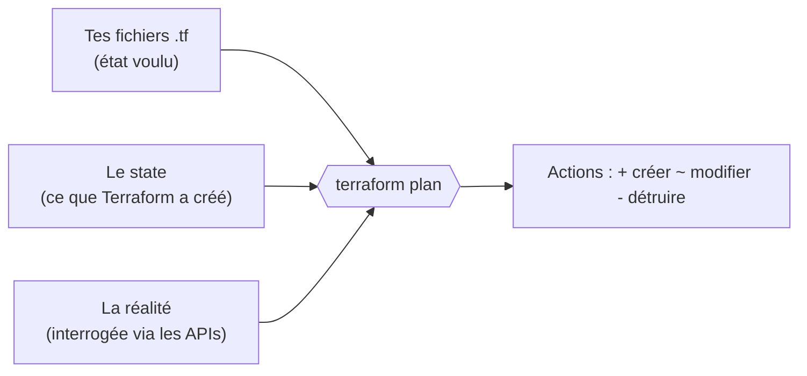

# Bloc 5 : Infrastructure as Code, Terraform et Ansible

## 1. Le problème que l'IaC résout

Sans IaC, une infrastructure se construit à la main : on clique dans une
console web, on tape des commandes sur un serveur, on ajuste un fichier de
conf en SSH. Trois maladies apparaissent vite :

- **Le serveur flocon de neige** (*snowflake server*) : unique, façonné par
  des années de commandes oubliées, impossible à reconstruire à l'identique.
  Le jour où il meurt, personne ne sait le refaire.
- **La dérive de configuration** (*configuration drift*) : les serveurs
  censés être identiques divergent peu à peu (un correctif appliqué ici mais
  pas là, une valeur changée à la main pour déboguer puis oubliée).
- **La connaissance orale** : l'infrastructure n'existe que dans la tête de
  ceux qui l'ont construite. Pas de revue, pas d'historique, pas de rollback.

L'**Infrastructure as Code** applique aux serveurs ce que Git a apporté au
code : l'infrastructure est **décrite dans des fichiers texte versionnés**,
et un outil fait converger la réalité vers cette description. Conséquences :

- reconstruire = rejouer les fichiers (plus de serveur irremplaçable) ;
- l'historique Git dit *qui* a changé *quoi*, *quand* et *pourquoi* ;
- une modification d'infrastructure se **relit en pull request**, comme du code ;
- le même code produit les environnements dev, staging et prod : fini le
  « ça marche en dev mais pas en prod ».

C'est le prolongement direct du GitOps du bloc 4 : Git comme source de
vérité, un outil qui réconcilie l'état réel avec l'état déclaré.

### Déclaratif, pas impératif

Les deux outils de ce bloc sont **déclaratifs** : on décrit l'état cible
(le *quoi*), l'outil calcule les actions (le *comment*). Compare :

| Approche | Script impératif | Outil déclaratif |
|---|---|---|
| On écrit | « crée un bucket » | « un bucket doit exister » |
| 2e exécution | erreur (il existe déjà) ou doublon | rien à faire, l'état est atteint |
| Suppression d'une ligne | le bucket reste (orphelin) | l'outil le détruit (il n'est plus déclaré) |
| Après une panne | on relance et on prie | l'outil recalcule l'écart et le comble |

La propriété clé qui en découle est l'**idempotence** : exécuter une fois ou
dix fois produit le même état final. C'est elle qui rend l'automatisation
digne de confiance, et tu la vérifieras expérimentalement deux fois dans ce
bloc (un `terraform plan` vide, un run Ansible à `changed=0`).

### Deux outils, deux métiers

| | **Terraform** | **Ansible** |
|---|---|---|
| Métier | **Provisionner** : créer les ressources (buckets, réseaux, VMs, clusters) | **Configurer** : amener des machines existantes à l'état voulu (paquets, fichiers, services) |
| Répond à | « de quoi mon infra est-elle faite ? » | « qu'y a-t-il d'installé et configuré dessus ? » |
| Garde un état | oui, le *state* (mémoire de ce qu'il a créé) | non : il constate l'état réel à chaque exécution |
| Modèle | parle aux APIs des fournisseurs | se connecte aux machines (SSH), sans agent à installer |

En entreprise ils se complètent : Terraform crée la VM, Ansible la
configure. Dans ce bloc, Terraform provisionne un bucket S3 (sur un AWS
simulé) et Ansible configure deux serveurs (simulés par des conteneurs).

## 2. Les concepts de Terraform

### Provider, resources et graphe

Un fichier Terraform (`.tf`) déclare des **resources**, les briques
d'infrastructure. Chaque resource a un type (`aws_s3_bucket`) et un nom
local (`data_lake`) :

```hcl
resource "aws_s3_bucket" "data_lake" {
  bucket = "${var.project}-data-lake"
}

resource "aws_s3_object" "readme" {
  bucket = aws_s3_bucket.data_lake.id   # référence -> dépendance
  key    = "README.txt"
}
```

Le **provider** est le plugin qui sait traduire ces déclarations en appels
d'API : le provider `aws` parle à AWS, `google` à GCP, `kubernetes` à un
cluster. Il en existe des milliers, c'est ce qui fait de Terraform un outil
universel de provisionnement.

Note la référence `aws_s3_bucket.data_lake.id` dans le deuxième bloc : les
références entre resources forment un **graphe de dépendances**. Terraform
en déduit tout seul l'ordre de création (le bucket avant l'objet) et de
destruction (l'inverse). Tu ne géreras jamais un ordre d'exécution.

### Le state : la mémoire de Terraform

Question piège : si je supprime un bloc `resource` de mes fichiers, comment
Terraform sait-il qu'il doit détruire quelque chose ? La resource n'est plus
décrite nulle part... C'est le rôle du **state** (`terraform.tfstate`) : un
fichier JSON où Terraform note tout ce qu'il a créé et les identifiants
réels correspondants. À chaque exécution, il compare **trois** sources :



- déclaré mais absent du state : **créer** ;
- dans le state mais plus déclaré : **détruire** ;
- déclaré et existant mais différent (quelqu'un a modifié à la main) :
  **corriger**, c'est la détection de dérive.

Deux règles pratiques en découlent. Le state ne va **jamais dans Git** : il
contient l'état réel, parfois des secrets, et deux personnes qui l'utilisent
en même temps le corrompent (en équipe, on le stocke dans un *backend*
partagé avec verrouillage : un bucket S3, Terraform Cloud...). Et on ne
modifie **jamais à la main** ce que Terraform gère, sinon on crée
précisément la dérive qu'il doit combattre.

### Le cycle init, plan, apply

```bash
terraform init      # télécharge providers et modules (1 fois par projet)
terraform plan      # calcule et AFFICHE l'écart, ne touche à rien
terraform apply     # affiche le plan, demande confirmation, applique
terraform destroy   # détruit tout ce que le state connaît
```

Le `plan` est la moitié de la valeur de Terraform : c'est une **prédiction
relisible avant d'agir**. En entreprise, le plan est posté dans la pull
request et relu comme du code ; un `-destroy` inattendu dans un plan a sauvé
d'innombrables bases de production. Prends dès maintenant l'habitude de le
lire ligne par ligne : `+` créer, `~` modifier en place, `-/+` détruire puis
recréer (attention aux données !).

### Variables, outputs, modules

- Les **variables** (`variables.tf`) paramètrent le code : le même fichier
  sert pour dev et prod en changeant `-var environment=prod` ou un fichier
  `.tfvars`. Chaque variable a un type, une description et souvent une
  valeur par défaut.
- Les **outputs** (`outputs.tf`) exposent les valeurs produites (nom du
  bucket, IP créée...) : lisibles par un humain (`terraform output`) ou par
  un autre outil, c'est l'interface de sortie de ton infrastructure.
- Les **modules** empaquettent un groupe de resources réutilisable (un
  « bucket configuré selon les standards de l'équipe ») qu'on instancie
  comme une fonction, avec des variables en entrée et des outputs en
  sortie. Tout dossier Terraform est déjà un module : le *root module*.

## 3. Les concepts d'Ansible

### L'inventaire : à qui on parle

L'**inventaire** liste les machines cibles et les range en **groupes**. Les
plays visent un groupe, jamais une machine en dur :

```ini
[web]
srv1 http_port=8081
srv2 http_port=8082
```

Une machine peut porter des **variables d'hôte** (ici `http_port`), un
groupe des variables de groupe. L'inventaire est la frontière entre « quoi
faire » (le playbook, générique) et « sur quoi » (l'inventaire, spécifique).
C'est pour ça que le même playbook configure ton lab de conteneurs
aujourd'hui et un parc de VMs demain : seul l'inventaire change.

### Tâches et modules : déclarer un état

Une **tâche** invoque un **module** (apt, template, copy, user, service :
il en existe des milliers) en décrivant un état voulu :

```yaml
- name: Installer curl
  ansible.builtin.apt:
    name: curl
    state: present     # "présent", pas "installe-le"
```

`state: present` et non « exécute apt install » : le module vérifie d'abord
l'état réel, n'agit que si nécessaire, et rapporte honnêtement `ok` (rien à
faire) ou `changed` (j'ai agi). L'idempotence d'Ansible est la somme de
celle de ses modules. Corollaire : le module `shell` / `command`, qui
exécute une commande brute, casse cette garantie ; on ne l'utilise qu'en
dernier recours.

### Playbook, plays, rôles

Le **playbook** est le fichier YAML orchestrateur. Il contient des **plays**,
chacun appliquant des tâches ou des rôles à un groupe de l'inventaire. Le
**rôle** est l'unité de réutilisation : un dossier auto-suffisant à la
structure conventionnelle :

```
roles/webserver/
├── defaults/main.yml    # variables par défaut (surchargeables)
├── tasks/main.yml       # les tâches
├── templates/           # les templates Jinja2
└── handlers/main.yml    # (optionnel) actions déclenchées par un changement
```

Les **handlers** méritent un mot : ce sont des tâches qui ne s'exécutent que
si une autre tâche a rapporté `changed`, typiquement « redémarrer le service
si (et seulement si) la conf a changé ». Encore l'idempotence : pas de
redémarrage inutile.

### Templates et variables : un fichier par machine

Un **template** Jinja2 est un fichier à trous, rempli pour chaque hôte avec
ses variables et ses **facts** (les informations qu'Ansible collecte
automatiquement au début du play : OS, IPs, CPU, date...) :

```html
<h1>{{ inventory_hostname }}</h1>
<p>Port publié : {{ http_port }}. Généré le {{ ansible_date_time.date }}.</p>
```

Même template, résultat différent sur `srv1` et `srv2` : c'est comme ça
qu'on tue la dérive de configuration, le fichier de conf de chaque machine
est *généré* depuis une source unique. Les variables ont une **précédence**
(les `defaults` d'un rôle perdent face à l'inventaire, qui perd face à
`-e` en ligne de commande) : c'est ce qui permet des rôles génériques
personnalisés par environnement.

### Sans agent, en push

Ansible n'installe **rien** sur les cibles : il se connecte (SSH en général)
et exécute ses modules via le Python de la machine distante. Modèle
*push* : tu déclenches, il pousse. (Dans ce bloc, le plugin de connexion
`containers.podman` remplace juste SSH par `podman exec` : tout le reste
est identique.)

---

## 4. Installer les outils

```bash
# Terraform : binaire unique (adapter la version, voir releases.hashicorp.com)
VER=$(curl -s https://checkpoint-api.hashicorp.com/v1/check/terraform \
      | python3 -c "import sys,json; print(json.load(sys.stdin)['current_version'])")
curl -sLo /tmp/terraform.zip "https://releases.hashicorp.com/terraform/${VER}/terraform_${VER}_linux_amd64.zip"
unzip -o /tmp/terraform.zip -d ~/.local/bin && terraform version

# Ansible + la collection qui permet de cibler des conteneurs Podman
sudo apt install ansible        # ou : pipx install ansible-core
ansible-galaxy collection install containers.podman
```

!!! note "Terraform ou OpenTofu ?"
    OpenTofu est le fork communautaire de Terraform (licence vraiment libre),
    compatible à la commande près : tout ce bloc fonctionne en remplaçant
    `terraform` par `tofu`.

## 5. LocalStack : un AWS local dans un conteneur

Pratiquer le provisionnement demande un fournisseur à provisionner.
**LocalStack** émule les APIs AWS (S3, SQS, DynamoDB...) dans un conteneur :
mêmes appels, mêmes outils, zéro compte et zéro facture. La stack est dans
[`infra/localstack/`](https://github.com/menraromial/tuto-infra/tree/main/infra/localstack) :

```bash
cd infra/localstack
podman compose up -d
curl -s http://localhost:4566/_localstack/health | python3 -m json.tool | grep s3
# "s3": "available"
```

Tout passe par le port unique **4566**. Attention : sans persistance
(payante), **l'état repart de zéro à chaque redémarrage** du conteneur : il
suffit de rejouer `terraform apply`, c'est justement l'intérêt de l'IaC.

Trois façons de l'inspecter : la CLI embarquée
(`podman exec localstack awslocal s3 ls`), les endpoints HTTP
(`curl http://localhost:4566/_localstack/health`), ou l'application web
officielle [app.localstack.cloud](https://app.localstack.cloud) (compte
gratuit ; le Resource Browser S3 se connecte à ton instance locale depuis
ton navigateur).

## 6. Pratique Terraform : provisionner un bucket S3

Les fichiers commentés sont dans
[`exercices/bloc5/terraform/`](https://github.com/menraromial/tuto-infra/tree/main/exercices/bloc5/terraform) :
`main.tf` (provider + 3 resources), `variables.tf`, `outputs.tf`. Seul le
bloc `endpoints { s3 = "http://localhost:4566" }` du provider le détourne
vers LocalStack : tout le reste est du Terraform AWS standard.

```bash
cd exercices/bloc5/terraform

terraform init      # télécharge le provider AWS
terraform plan      # LIS-LE : 3 resources en "+", rien d'autre
terraform apply     # confirme avec "yes"
```

Sortie attendue :

```
Apply complete! Resources: 3 added, 0 changed, 0 destroyed.

Outputs:
bucket_arn = "arn:aws:s3:::tuto-data-lake"
bucket_name = "tuto-data-lake"
```

Vérifie, prouve l'idempotence, expérimente la détection de dérive :

```bash
# La réalité : le bucket existe et contient l'objet
podman exec localstack awslocal s3 ls s3://tuto-data-lake/
podman exec localstack awslocal s3 cp s3://tuto-data-lake/README.txt -

# Idempotence : l'état cible est atteint, le plan est vide
terraform plan
# "No changes. Your infrastructure matches the configuration."

# Dérive : supprime l'objet À LA MAIN puis replanifie
podman exec localstack awslocal s3 rm s3://tuto-data-lake/README.txt
terraform plan     # Terraform propose de RECRÉER l'objet : dérive détectée
terraform apply

# Et pour tout défaire proprement :
terraform destroy
```

Regarde aussi une fois le fichier `terraform.tfstate` (sans le modifier !)
pour toucher du doigt ce que Terraform mémorise.

## 7. Pratique Ansible : configurer deux serveurs

Les fichiers sont dans
[`exercices/bloc5/ansible/`](https://github.com/menraromial/tuto-infra/tree/main/exercices/bloc5/ansible) :
l'inventaire vu plus haut, `playbook.yml`, et le rôle `webserver` complet.
Cible d'entraînement : deux conteneurs qui servent `/srv/www` en HTTP.

```bash
cd exercices/bloc5/ansible
bash setup-conteneurs.sh
# >> srv1 créé (http://localhost:8081)
# >> srv2 créé (http://localhost:8082)

# Premier contact en mode ad-hoc (une commande, pas de playbook) :
ansible web -m ping
# srv1 | SUCCESS => { "ping": "pong" }
# srv2 | SUCCESS => { "ping": "pong" }
```

Puis le playbook, deux fois :

```bash
ansible-playbook playbook.yml
# srv1 : ok=3 changed=2    <- curl installé + page générée
# srv2 : ok=3 changed=2

curl -s http://localhost:8081/    # page personnalisée srv1
curl -s http://localhost:8082/    # page personnalisée srv2

ansible-playbook playbook.yml     # 2e run
# srv1 : ok=3 changed=0    <- état atteint : idempotent
```

Relis maintenant le rôle à la lumière des concepts : `defaults/main.yml`
(variables surchargeables), `tasks/main.yml` (états déclarés, pas de
commande brute), `templates/index.html.j2` (variables d'hôte + facts).
Expérimente la précédence des variables :

```bash
ansible-playbook playbook.yml -e "web_message='Surcharge en ligne de commande'"
curl -s http://localhost:8081/   # le message a changé (et changed=1 : normal !)
```

## Exercice final du bloc

Il combine les deux moitiés, et tu viens de le faire en suivant la page :

1. **Terraform** : bucket S3 versionné sur LocalStack, avec objet, variables
   et outputs. Critères : `apply` propre, `awslocal s3 ls` montre le bucket,
   un second `plan` ne propose **aucun** changement, et tu sais provoquer et
   corriger une dérive.
2. **Ansible** : deux conteneurs configurés par un playbook avec rôle et
   template. Critères : pages personnalisées sur 8081/8082, second run à
   `changed=0`, et tu sais expliquer pourquoi chaque tâche est idempotente.

Pour aller plus loin : côté Terraform, une variable `environments` (liste)
et un bucket par environnement avec `for_each` ; côté Ansible, un handler
qui ne se déclenche que si le template a changé, ou un second rôle appliqué
à un nouveau groupe d'inventaire.

## Dépannage

??? failure "`terraform apply` : connexion refusée sur localhost:4566"
    LocalStack n'est pas démarré ou pas encore healthy :
    ```bash
    podman ps --filter name=localstack     # attendre "(healthy)"
    curl -s http://localhost:4566/_localstack/health
    ```

??? failure "L'AWS CLI de la machine échoue (librairies Python, credentials...)"
    Utilise celle embarquée dans le conteneur, préconfigurée pour LocalStack :
    ```bash
    podman exec localstack awslocal s3 ls
    ```

??? failure "`curl localhost:8081` : connexion réinitialisée, mais le conteneur tourne"
    Sur beaucoup de machines, `localhost` résout d'abord en IPv6 (`::1`), et
    un serveur qui n'écoute qu'en IPv4 refuse la connexion transmise par
    Podman. C'est pour ça que `setup-conteneurs.sh` lance `http.server` avec
    `--bind ::` (double pile). Si tu crées tes propres conteneurs, pense-y,
    ou teste avec `curl 127.0.0.1:8081`.

??? failure "Ansible : `srv1 | UNREACHABLE` ou plugin de connexion introuvable"
    - La collection est-elle installée ?
      `ansible-galaxy collection install containers.podman`
    - Les conteneurs tournent-ils ? `podman ps --filter name=srv`
    - Le nom d'hôte de l'inventaire doit être exactement le nom du conteneur.

??? failure "Le bucket a disparu après un redémarrage"
    Normal : LocalStack communautaire ne persiste rien. Rejoue
    `terraform apply`, c'est l'intérêt d'avoir tout en code.
