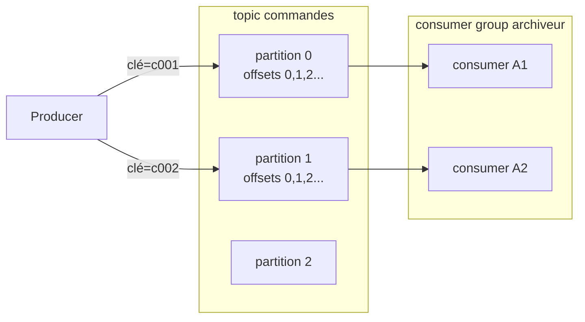

# Bloc 6 : Architecture d'ingestion de données

Objectif du bloc : comprendre comment les données **entrent** dans une
plateforme data, et construire le premier étage de la nôtre : des évènements
JSON produits dans un broker Kafka (Redpanda), consommés et archivés en
fichiers Parquet, prêts pour le lake du bloc 7.

## 1. Batch, streaming, micro-batch

Trois façons de déplacer la donnée, et un choix qui structure toute
l'architecture :

| Mode | Principe | Latence | Exemples |
|---|---|---|---|
| **Batch** | On traite un paquet complet à intervalle fixe | minutes à heures | export nocturne d'une base, fichiers déposés chaque jour |
| **Streaming** | Chaque évènement circule dès qu'il se produit | millisecondes à secondes | clics, paiements, capteurs, logs |
| **Micro-batch** | Le flux est découpé en petits lots fréquents | secondes à minutes | notre consumer Parquet, Spark Structured Streaming |

Comment choisir : commence par la question « **quelle fraîcheur est
réellement nécessaire ?** ». Un rapport quotidien n'a pas besoin de
streaming, une détection de fraude oui. Le batch est plus simple à écrire,
tester et reprendre après une panne ; le streaming impose de raisonner sur
l'ordre, les doublons et l'état. Beaucoup de plateformes réelles font du
micro-batch : les évènements arrivent en continu dans Kafka, l'aval les
consomme par lots. C'est exactement ce qu'on construit dans ce bloc.

## 2. D'où viennent les données : les sources

- **Bases opérationnelles** (PostgreSQL, MySQL...) : les données des
  applications. On ne branche jamais l'analytique dessus directement (les
  requêtes lourdes étrangleraient la production) : on les **ingère**.
- **APIs** : partenaires, SaaS, services internes. Ingestion par appels
  périodiques (batch) avec pagination et gestion de quotas.
- **Fichiers** : exports, dépôts partenaires (CSV, JSON, Parquet...).
- **Évènements** : émis par les applications au fil de l'eau (clic, commande,
  mesure de capteur). C'est la source native du streaming.

Notre stack contient une base PostgreSQL `boutique` qui joue la source
opérationnelle, et un producteur d'évènements de commande qui joue la
source évènementielle.

### Le cas des bases : Change Data Capture (concept)

Pour ingérer une base qui change en permanence, deux stratégies. La naïve :
re-exporter la table entière chaque nuit (simple, mais lourd et en retard
d'un jour). La fine : le **CDC** (*Change Data Capture*), qui lit le
**journal de transactions** de la base (le WAL de PostgreSQL) et transforme
chaque INSERT/UPDATE/DELETE en évènement Kafka. L'outil de référence est
**Debezium** : la base devient elle-même un flux, sans requête intrusive.
Retiens le concept et le nom ; le mettre en place demanderait un connecteur
de plus, hors périmètre de ce bloc.

## 3. Les formats de données (et pourquoi Parquet gagne)

Distinction fondamentale : format **ligne** (chaque enregistrement est
stocké entier, l'un après l'autre) contre format **colonne** (toutes les
valeurs d'une même colonne sont stockées ensemble).

| Format | Type | Schéma | Compression | Usage typique |
|---|---|---|---|---|
| CSV | ligne, texte | aucun (tout est chaîne) | faible | échange simple, tableurs |
| JSON | ligne, texte | implicite, souple | faible | APIs, évènements |
| Avro | ligne, binaire | déclaré et versionné | bonne | messages Kafka |
| **Parquet** | **colonne**, binaire | déclaré, embarqué | **excellente** | **analytique, data lake** |

Pourquoi le colonne gagne en analytique : une requête du type « moyenne du
prix par produit » ne lit **que** deux colonnes ; en Parquet, le moteur ne
touche pas aux autres. Et une colonne contient des valeurs homogènes qui se
compressent très bien (dictionnaires, encodages par plages). Résultat :
fichiers plus petits, requêtes plus rapides, et un schéma typé embarqué
(fini le CSV où tout est chaîne). Règle pratique : **ligne pour transporter
(JSON/Avro), colonne pour analyser (Parquet)**. Notre exercice fait
exactement cette conversion : JSON dans Kafka, Parquet à l'arrivée.

## 4. Kafka : le journal distribué

Kafka (et Redpanda, son implémentation compatible que nous utilisons) n'est
**pas une file de messages** : c'est un **journal** (*log*). Les messages
sont écrits à la suite, immuables, et restent lisibles pendant leur durée de
rétention. Consommer ne détruit rien : dix équipes peuvent lire le même
topic chacune à son rythme.



Les cinq notions à maîtriser :

- **Topic** : le canal nommé (`commandes`). Un topic est découpé en...
- **Partitions** : des sous-journaux indépendants. C'est l'unité de
  parallélisme : N partitions = au plus N consommateurs actifs d'un même
  groupe. L'**ordre n'est garanti qu'à l'intérieur d'une partition**.
- **Offset** : la position d'un message dans sa partition (0, 1, 2...).
  Un consommateur progresse en avançant son offset.
- **Producer** : écrit dans le topic. S'il fournit une **clé**, elle est
  hachée pour choisir la partition : même clé, même partition, donc les
  évènements d'un même client restent ordonnés entre eux. (Tu le verras :
  nos 5 clés clients ne tombent que sur 2 des 3 partitions, le hachage ne
  répartit pas uniformément un si petit nombre de clés.)
- **Consumer group** : des consommateurs qui se partagent les partitions
  d'un topic et **commitent** leur position (les offsets) sous un nom de
  groupe. Redémarrer = reprendre où on s'était arrêté. Deux groupes
  différents lisent le même topic indépendamment.

### Sémantiques de livraison et idempotence

Que se passe-t-il si le consommateur plante entre « j'ai traité le message »
et « j'ai commité mon offset » ? Trois contrats possibles :

- **au plus une fois** : commiter avant de traiter. Un crash peut perdre des
  messages. Rarement acceptable.
- **au moins une fois** : traiter puis commiter. Un crash peut faire
  retraiter des messages : des **doublons**, mais jamais de perte. C'est le
  choix de notre consumer (commit manuel après l'écriture du fichier).
- **exactement une fois** : le graal, coûteux et fragile ; en pratique on
  l'approche en combinant « au moins une fois » avec un aval **idempotent**.

D'où la règle d'or de l'ingestion : chaque évènement porte un identifiant
unique (notre `event_id`), et l'aval **déduplique** sur cet identifiant.
Doublons + déduplication = le résultat final est le même que si chaque
message n'était arrivé qu'une fois. Tu le vérifieras expérimentalement.

## 5. La stack du bloc

Fichiers dans [`infra/ingestion/`](https://github.com/menraromial/tuto-infra/tree/main/infra/ingestion) :

```bash
cd infra/ingestion
podman compose up -d
podman ps --filter label=com.docker.compose.project=ingestion
# redpanda et ingestion-postgres doivent être "(healthy)"
```

Quatre services :

- **redpanda** : le broker Kafka, un seul conteneur (pas de ZooKeeper ni de
  JVM). Note la config des deux **listeners** dans le compose : les autres
  conteneurs le joignent en `redpanda:9092` (réseau interne), ta machine en
  `localhost:19092`. C'est le même besoin d'« adresse annoncée » que le
  `ROOT_URL` de Gitea au bloc 4 : un broker dit aux clients où le recontacter,
  et cette adresse doit être valide depuis là où le client se trouve.
- **console** : l'interface web de Redpanda (voir ci-dessous).
- **postgres** : la base source `boutique`, pré-remplie par `init.sql`
  (5 clients). Sur le port hôte **5433** pour ne pas gêner un PostgreSQL local.
- **adminer** : interface web pour explorer PostgreSQL.

## 6. Accès aux interfaces web

### Redpanda Console : http://localhost:8090

Aucun identifiant demandé. À explorer dès maintenant, puis pendant
l'exercice :

- **Topics → commandes** : les messages en clair (la console décode le
  JSON), la partition et l'offset de chacun ; onglet *Partitions* pour voir
  la répartition.
- **Consumer Groups → archiveur-parquet** (après le premier run du
  consumer) : la position commitée de chaque partition et surtout le
  **lag** (messages en attente), la métrique de santé numéro un d'un
  pipeline streaming.
- **Overview** : santé du broker, versions, espace disque.

### Adminer (PostgreSQL) : http://localhost:8091

Formulaire de connexion :

| Champ | Valeur |
|---|---|
| Système | PostgreSQL |
| Serveur | `postgres` (nom du conteneur, pas localhost !) |
| Utilisateur | `demo` |
| Mot de passe | `demo` |
| Base de données | `boutique` |

Une fois connecté : dans la colonne de gauche, clique sur la table
**clients** puis sur **« Afficher les données »** pour voir les 5 lignes
insérées par `init.sql`. L'onglet **« Requête SQL »** permet d'exécuter du
SQL librement, par exemple :

```sql
SELECT ville, count(*) FROM clients GROUP BY ville;
```

!!! warning "Le piège du champ « Serveur » : `postgres`, pas `localhost`"
    Adminer tourne **dans un conteneur** : pour lui, `localhost` désigne son
    propre conteneur, pas ta machine. Il joint la base par le DNS du réseau
    compose (le nom du service, `postgres`), exactement comme les jobs CI
    joignaient `gitea:3000` au bloc 4.

L'équivalent en terminal, depuis ta machine cette fois (donc `localhost`,
sur le port publié 5433) :

```bash
psql -h localhost -p 5433 -U demo boutique     # mot de passe : demo
```

## 7. Prise en main avec rpk

`rpk` est la CLI de Redpanda (équivalent des scripts `kafka-*.sh`), incluse
dans le conteneur :

```bash
# Créer le topic de l'exercice : 3 partitions
podman exec redpanda rpk topic create commandes --partitions 3

# Produire un message à la main...
echo "test depuis rpk" | podman exec -i redpanda rpk topic produce commandes

# ...et le relire (topic, partition, offset : tout y est)
podman exec redpanda rpk topic consume commandes --num 1 --offset start

# L'état du topic
podman exec redpanda rpk topic describe commandes
```

Va voir ce message dans la console (Topics → commandes) avant de passer à
la suite.

## Exercice final : producer JSON → consumer → Parquet

Les fichiers commentés sont dans
[`exercices/bloc6/`](https://github.com/menraromial/tuto-infra/tree/main/exercices/bloc6) :
`producer.py` et `consumer_parquet.py`.

### 1. Préparer l'environnement Python

```bash
cd exercices/bloc6
python3 -m venv .venv
.venv/bin/pip install -r requirements.txt   # confluent-kafka + pyarrow
```

### 2. Lire puis lancer le producer

Points à repérer dans `producer.py` avant de le lancer : l'`event_id`
(uuid4, la clé de déduplication), la **clé Kafka** `client_id` (même client,
même partition), le *callback* d'accusé de réception, et le `flush()` final
sans lequel le programme peut se terminer avant l'envoi réel.

```bash
.venv/bin/python producer.py --nombre 500
# 500/500 évènements produits dans 'commandes'
```

Va voir dans la console : Topics → commandes → 501 messages (500 + ton test
rpk), et la répartition par partition.

### 3. Lire puis lancer le consumer

Points à repérer dans `consumer_parquet.py` : le `group.id`
(`archiveur-parquet`), `auto.offset.reset: earliest` (au premier démarrage
du groupe, commencer au début), `enable.auto.commit: False` et le
`consumer.commit()` placé **après** l'écriture du fichier (c'est ça, le
« au moins une fois »), le découpage en lots, et l'arrêt automatique après
5 secondes de silence.

```bash
.venv/bin/python consumer_parquet.py --lot 200
# écrit commandes-...-lot0001-200evts.parquet
# écrit commandes-...-lot0002-200evts.parquet
# écrit commandes-...-lot0003-100evts.parquet
# terminé : 500 évènements archivés dans .../exercices/bloc6/data/
```

### 4. Vérifier le résultat

```bash
.venv/bin/python - <<'EOF'
import pyarrow.parquet as pq
from pathlib import Path
tables = [pq.read_table(f) for f in sorted(Path("data").glob("*.parquet"))]
total = sum(t.num_rows for t in tables)
ids = {e for t in tables for e in t.column("event_id").to_pylist()}
print("lignes:", total, "| event_id uniques:", len(ids))
print(tables[0].schema)
EOF
```

Attendu : 500 lignes, 500 `event_id` uniques, et un schéma **typé**
(`quantite: int64`, `prix_unitaire: double`) : c'est le gain du Parquet sur
le JSON d'origine. Dans la console, Consumer Groups → archiveur-parquet doit
montrer un lag de 0.

### 5. Expérimenter le « au moins une fois »

Rejoue le passé : remets la position du groupe au début et relance le
consumer.

```bash
podman exec redpanda rpk group seek archiveur-parquet --to start
.venv/bin/python consumer_parquet.py --lot 200
```

Nouveaux fichiers, 500 évènements de plus : **des doublons**, exactement ce
que « au moins une fois » autorise. Relance maintenant le script de
vérification : le nombre de lignes a doublé mais le nombre d'`event_id`
**uniques** est resté 500. La déduplication par identifiant transforme des
doublons inévitables en résultat exact : c'est l'idempotence à l'ingestion,
et c'est le bloc 7 (transformations) qui l'appliquera pour de bon.

**Critères de réussite** : les Parquet contiennent tous les évènements avec
un schéma typé ; le lag du groupe est à 0 dans la console ; tu sais
expliquer pourquoi le commit est après l'écriture, et prouver qu'un rejeu
crée des doublons que l'`event_id` permet d'éliminer.

## Dépannage

??? failure "`podman compose up` : `toomanyrequests` (limite Docker Hub)"
    Les pulls anonymes sont limités. Authentifie-toi (compte Docker Hub
    gratuit) : `podman login docker.io`, puis relance.

??? failure "Le port 5432 est déjà pris"
    Un PostgreSQL tourne déjà sur ta machine : c'est prévu, notre compose
    publie la base sur **5433**. Depuis l'hôte :
    `psql -h localhost -p 5433 -U demo boutique`.

??? failure "`pip install` compile pyarrow pendant de longues minutes puis échoue"
    Il n'existe pas encore de wheel pyarrow pour ta version de Python (trop
    récente) et pip tente une compilation. Mets à jour la version de pyarrow
    dans `requirements.txt`, ou crée le venv avec un Python plus ancien :
    `python3.12 -m venv .venv`.

??? failure "Le producer Python ne se connecte pas (`localhost:19092`)"
    - Redpanda est-il healthy ? `podman ps --filter name=redpanda`
    - C'est bien **19092** depuis ta machine (le listener externe), 9092 ne
      fonctionne qu'entre conteneurs. Si tu changes ces ports, l'adresse
      **annoncée** (`--advertise-kafka-addr`) doit suivre : un client Kafka
      se connecte d'abord au port donné, puis se reconnecte à l'adresse que
      le broker lui annonce.

??? failure "Le consumer se lance mais ne lit rien (0 évènement)"
    Le groupe `archiveur-parquet` a déjà commité des offsets à la fin du
    topic (`auto.offset.reset` ne joue qu'à la première connexion d'un
    groupe). Pour relire depuis le début :
    ```bash
    podman exec redpanda rpk group seek archiveur-parquet --to start
    ```
    (Le groupe doit être inactif : arrête le consumer d'abord.)

??? failure "Il manque des évènements dans les fichiers Parquet"
    Deux lots écrits dans la même seconde peuvent produire le même nom de
    fichier et s'écraser : c'est arrivé pendant l'écriture de ce tutoriel.
    Le script inclut désormais un numéro de lot dans le nom. Si tu écris ton
    propre consumer, garantis l'unicité des noms de fichiers.
