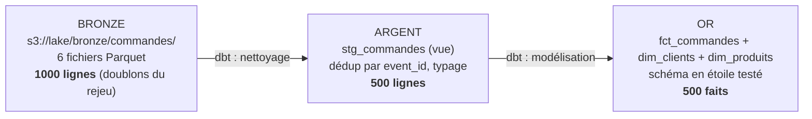

# Bloc 7 : Data lake et data warehouse (MinIO, DuckDB, dbt)

Objectif du bloc : donner un **domicile durable** aux données ingérées au
bloc 6, puis les transformer en tables prêtes pour l'analyse. Tu vas
construire un lake (MinIO), un warehouse (DuckDB) et la chaîne de
transformation entre les deux (dbt), en suivant l'architecture médaillon.

## 1. Lake, warehouse, lakehouse : les vraies différences

| | **Data lake** | **Data warehouse** | **Lakehouse** |
|---|---|---|---|
| Stocke | des **fichiers** bruts (Parquet, JSON, images...) | des **tables** structurées et modélisées | des fichiers ouverts qui se comportent comme des tables |
| Schéma | à la **lecture** (*schema-on-read*) | à l'**écriture** (*schema-on-write*) | déclaré dans un format de table (Iceberg, Delta) |
| Force | tout garder, pas cher, flexible | requêtes SQL rapides et fiables | les deux, sans copier les données |
| Risque | devenir un « data swamp » ingérable | rigidité, coût, silos | jeunesse de l'outillage |
| Chez nous | **MinIO** (compatible S3) | **DuckDB** | aperçu en fin de bloc |

Les deux ne s'opposent pas, ils se **succèdent** : le lake reçoit tout, tel
quel, sans rien casser ; le warehouse expose une version modelée, testée et
rapide à interroger. La question n'est pas « lake ou warehouse ? » mais
« comment organiser le passage de l'un à l'autre ? ». Réponse :

## 2. L'architecture médaillon : bronze, argent, or

Trois couches, chacune avec un contrat clair :

- **Bronze** : la donnée **brute, telle qu'arrivée**, jamais modifiée. C'est
  l'assurance-vie de la plateforme : tout est rejouable depuis là. Doublons
  et erreurs y sont normaux.
- **Argent** : la donnée **nettoyée** : dédupliquée, typée, normalisée.
  Une ligne = un fait métier réel.
- **Or** : la donnée **modelée pour l'usage** : schéma en étoile, agrégats,
  indicateurs. C'est ce que les analystes et les dashboards consomment.

Notre pipeline le met en scène avec les chiffres du bloc 6 :



Souviens-toi du bloc 6 : notre consumer « au moins une fois » a produit des
doublons lors du rejeu. Le bronze les **conserve** (c'est son rôle), l'argent
les **élimine** grâce à l'`event_id`. L'idempotence promise au bloc 6 se
réalise ici.

## 3. Le schéma en étoile : faits et dimensions

Le modèle de référence du warehouse depuis 30 ans (Kimball) :

- La **table de faits**, au centre : une ligne par évènement métier (le
  **grain** : chez nous, une commande), des **clés** vers les dimensions et
  des **mesures** numériques (quantité, montant) qu'on agrège.
- Les **dimensions**, autour : les axes d'analyse (qui ? quoi ? où ?
  quand ?), petites tables descriptives (clients, produits).

Pourquoi cette forme ? Parce que toutes les questions analytiques ont la
même structure : *« somme des mesures, par attribut de dimension »*. Chiffre
d'affaires **par ville** = `fct_commandes` joint `dim_clients`, groupé par
`ville`. Une seule jointure, lisible, rapide, et le SQL s'écrit presque tout
seul.

### Slowly Changing Dimensions (le concept)

Que faire quand un client déménage de Douala à Garoua ? Deux stratégies
classiques :

- **SCD type 1** : on écrase la ville. Simple, mais l'historique ment : ses
  anciennes commandes semblent venir de Garoua.
- **SCD type 2** : on ajoute une **nouvelle ligne** avec des dates de
  validité (`valide_de`, `valide_a`) ; les anciens faits pointent vers
  l'ancienne version. L'historique est exact, au prix d'une dimension plus
  complexe.

Retiens l'idée : une dimension n'est pas figée, et le choix type 1 / type 2
est une décision **métier** (a-t-on besoin de l'histoire ?), pas technique.

## 4. Partitionnement et formats colonnes

Le bloc 6 a montré pourquoi Parquet gagne (colonne, compression, schéma
embarqué). À l'échelle d'un lake s'ajoute le **partitionnement** : ranger
les fichiers par valeur de colonne dans l'arborescence :

```
s3://lake/bronze/commandes/jour=2026-07-17/....parquet
s3://lake/bronze/commandes/jour=2026-07-18/....parquet
```

Une requête filtrée sur le 18 juillet ne lit **que** ce dossier
(*partition pruning*). Règle : partitionner sur la colonne de filtre la plus
fréquente (presque toujours la date), sans excès : des milliers de
partitions minuscules coûtent plus cher qu'elles ne rapportent.

## 5. dbt : les transformations SQL industrialisées

**dbt** (*data build tool*) est devenu le standard des transformations en
warehouse. L'idée : chaque table ou vue est un fichier SQL (un **model**),
et dbt apporte ce qui manque au SQL brut :

- **`ref()`** : un model en référence un autre via
  `from {{ ref('stg_commandes') }}` ; dbt en déduit le **graphe de
  dépendances**, construit tout dans le bon ordre, et trace le lineage.
- **Matérialisations** : le même SQL peut devenir une vue (`view`, léger,
  recalculé) ou une table (`table`, matérialisée) : un mot dans la config.
- **Tests** : `unique`, `not_null`, `relationships`... déclarés en YAML à
  côté des colonnes. `dbt test` vérifie les données **après chaque build**.
- **Seeds** : des petits CSV de référentiel versionnés dans Git,
  chargés par `dbt seed`.
- **Docs** : `dbt docs generate` produit un site avec le graphe de lineage
  et la description de chaque colonne.

Le tout est du texte versionné dans Git : les transformations passent en
revue de code, comme l'infrastructure au bloc 5.

## 6. La stack du bloc

```bash
cd infra/lake
podman compose up -d
podman ps --filter name=minio    # attendre "(healthy)"
```

Un seul service : **MinIO**, le stockage objet compatible S3 (mêmes APIs,
mêmes outils qu'AWS S3, hébergé chez toi). C'est le successeur de LocalStack
du bloc 5 pour le rôle S3 : LocalStack simulait pour apprendre Terraform,
MinIO est un vrai stockage qu'on retrouve en production dans beaucoup
d'entreprises. Le warehouse, lui, n'a pas de serveur : **DuckDB** est un
moteur OLAP *embarqué* (un binaire, un fichier `.duckdb`), le « SQLite de
l'analytique », parfait pour un lab et de plus en plus courant en réel.

```bash
# DuckDB : un binaire unique
curl -sLo /tmp/duckdb.zip https://github.com/duckdb/duckdb/releases/latest/download/duckdb_cli-linux-amd64.zip
unzip -o /tmp/duckdb.zip -d ~/.local/bin && duckdb --version
```

## 7. Accès à l'interface web de MinIO

**http://localhost:9001** : connexion avec l'utilisateur `minio` et le mot
de passe `minio12345` (définis dans le compose ; change-les si la machine
n'est pas qu'à toi).

À explorer :

- **Object Browser → bucket `lake`** : navigue dans `bronze/commandes/` ;
  après l'étape suivante tu y verras les 6 fichiers Parquet, leur taille et
  leur date. Tu peux prévisualiser, télécharger, ou déposer des fichiers à
  la souris.
- **Buckets** : création de buckets, politique d'accès (public/privé),
  versioning, quotas.
- **Access Keys** : créer des paires de clés dédiées par application, plutôt
  que d'utiliser le compte racine partout (bonne pratique, même en lab).

L'API S3, elle, écoute sur **http://localhost:9000** : c'est l'endpoint que
`mc`, DuckDB et dbt utilisent.

## 8. Charger le bronze : les Parquet du bloc 6 dans MinIO

`mc` est le client en ligne de commande de MinIO. Sans installation, via un
conteneur sur le réseau de la stack :

```bash
podman run --rm --network lake_default --entrypoint sh \
  -v $(pwd)/exercices/bloc6/data:/data:ro quay.io/minio/mc:latest -c "
    mc alias set lake http://minio:9000 minio minio12345 &&
    mc mb -p lake/lake &&
    mc cp --recursive /data/ lake/lake/bronze/commandes/ &&
    mc ls --summarize lake/lake/bronze/commandes/"
# Total Objects: 6
```

Va vérifier dans la console web (Object Browser → lake → bronze/commandes).

!!! note "Pré-requis : les Parquet du bloc 6"
    Si `exercices/bloc6/data/` est vide (les données ne sont pas
    versionnées), rejoue l'exercice du bloc 6 : stack ingestion démarrée,
    `producer.py` puis `consumer_parquet.py`. Pour retrouver aussi les
    doublons pédagogiques : `rpk group seek archiveur-parquet --to start`
    et un second passage du consumer.

## Exercice final : du bronze à l'or avec dbt

Le projet dbt complet est dans
[`exercices/bloc7/`](https://github.com/menraromial/tuto-infra/tree/main/exercices/bloc7) :

```
exercices/bloc7/
├── dbt_project.yml              # nom, chemins, matérialisations par dossier
├── profiles.yml                 # connexion : DuckDB + accès S3 vers MinIO
├── seeds/clients.csv            # référentiel clients (versionné dans Git)
└── models/
    ├── staging/stg_commandes.sql    # ARGENT : lecture du bronze + dédup + typage
    ├── staging/schema.yml           # tests : event_id unique et not_null
    └── marts/
        ├── dim_clients.sql          # OR : dimension clients (depuis le seed)
        ├── dim_produits.sql         # OR : dimension produits (dérivée)
        ├── fct_commandes.sql        # OR : table de faits (grain = commande)
        └── schema.yml               # tests dont "relationships" (intégrité de l'étoile)
```

### 1. Installer et vérifier

```bash
cd exercices/bloc7
python3 -m venv .venv
.venv/bin/pip install -r requirements.txt    # dbt-duckdb

export DBT_PROFILES_DIR=.    # le profil est dans le dossier du projet
.venv/bin/dbt debug          # tout doit être vert
```

Avant de lancer, lis `models/staging/stg_commandes.sql` : la lecture directe
du lake (`read_parquet('s3://lake/bronze/...')`), la fenêtre
`row_number() over (partition by event_id ...)` qui déduplique, le `cast`
qui type l'horodatage.

### 2. Construire et tester

```bash
.venv/bin/dbt seed     # charge clients.csv
.venv/bin/dbt run      # construit la vue staging puis les 3 tables de l'étoile
.venv/bin/dbt test     # 12 tests : unicité, non-nullité, intégrité référentielle
```

Attendu : `run` termine sur `PASS=4`, `test` sur `PASS=12`. Le test
`unique` sur `event_id` de la couche argent est la **preuve automatisée**
que la déduplication fonctionne : s'il repasse au rouge un jour, c'est que
l'ingestion a changé de comportement.

### 3. Interroger l'étoile

```bash
duckdb warehouse.duckdb
```

```sql
-- Le médaillon en chiffres (le secret donne au CLI l'accès S3 au bronze) :
CREATE OR REPLACE SECRET minio (TYPE s3, KEY_ID 'minio', SECRET 'minio12345',
  ENDPOINT 'localhost:9000', USE_SSL false, URL_STYLE path, REGION 'us-east-1');

SELECT 'bronze' AS couche, count(*) FROM read_parquet('s3://lake/bronze/commandes/*.parquet')
UNION ALL SELECT 'argent', count(*) FROM stg_commandes
UNION ALL SELECT 'or', count(*) FROM fct_commandes;
--  bronze: 1000  |  argent: 500  |  or: 500

-- La requête type de l'étoile : chiffre d'affaires par ville
SELECT d.ville, sum(f.montant)::DECIMAL(10,2) AS ca, count(*) AS commandes
FROM fct_commandes f JOIN dim_clients d USING (client_code)
GROUP BY d.ville ORDER BY ca DESC;
```

### 4. La documentation et le lineage (interface web dbt)

```bash
.venv/bin/dbt docs generate
.venv/bin/dbt docs serve --port 8092
```

Ouvre **http://localhost:8092** : chaque model avec ses descriptions et ses
tests, et surtout le bouton en bas à droite (« Lineage Graph ») qui affiche
le graphe complet `seed → staging → étoile`. C'est la réponse à « d'où
vient cette table ? », et un avant-goût du lineage du bloc 8. Arrêt avec
`Ctrl+C`.

**Critères de réussite** : `dbt test` entièrement vert ; le compte
bronze/argent/ou raconte 1000 → 500 → 500 et tu sais expliquer chaque
passage ; la requête CA par ville tourne ; tu retrouves les fichiers bronze
dans la console MinIO et le lineage dans dbt docs.

## Aperçu : Delta Lake et Iceberg (le lakehouse)

Notre bronze est un simple dossier de fichiers : pas de transactions, pas de
suppression fiable, pas d'évolution de schéma. Les **formats de table**
(Apache Iceberg, Delta Lake) ajoutent une couche de métadonnées au-dessus
des Parquet qui apporte : transactions ACID, *time travel* (requêter l'état
d'hier), évolution de schéma, et fichiers compactés automatiquement. Le
lake se met alors à ressembler à un warehouse : c'est ça, le **lakehouse**.
DuckDB sait déjà lire Iceberg et Delta ; retiens les noms et le besoin
qu'ils couvrent.

## Dépannage

??? failure "`dbt run` : erreur `IO Error` ou `403` sur s3://lake/..."
    - MinIO tourne ? `podman ps --filter name=minio` (healthy)
    - Le bucket et les fichiers existent ? Console web, Object Browser.
    - Les réglages `s3_*` de `profiles.yml` doivent correspondre au compose
      (utilisateur, mot de passe, `s3_url_style: path`).

??? failure "`duckdb` en CLI ne lit pas s3:// alors que dbt y arrive"
    dbt configure la session via `profiles.yml` ; le CLI, lui, a besoin du
    `CREATE SECRET` montré plus haut (à refaire à chaque session, ou à
    mettre dans `~/.duckdbrc`).

??? failure "`python3 -m venv` échoue : `ensurepip is not available`"
    Le paquet venv de cette version de Python manque :
    `sudo apt install python3.x-venv` (remplace x), ou utilise la version de
    Python par défaut de ta machine.

??? failure "`dbt run` échoue : `Conflicting lock` sur warehouse.duckdb"
    DuckDB n'accepte qu'un écrivain à la fois : ferme le CLI `duckdb`
    ouvert sur le même fichier (ou l'onglet dbt docs) avant de relancer.

??? failure "La console MinIO refuse le login"
    Identifiants du compose : `minio` / `minio12345`. Si tu les as changés
    dans `compose.yaml` après le premier démarrage, le volume garde les
    anciens : `podman compose down -v` puis `up -d` (efface les données !).
