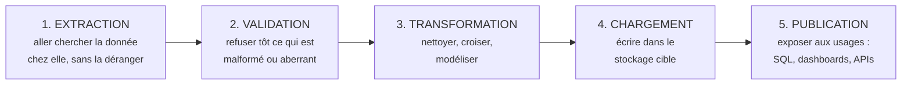
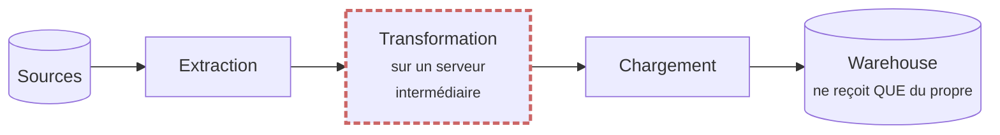
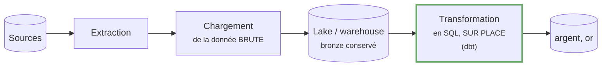
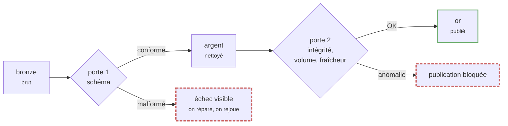
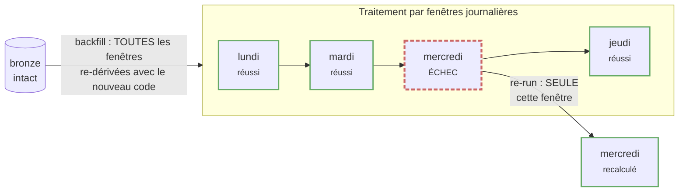
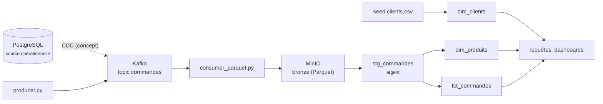

# Bloc 8 : Data pipelines, la vue d'ensemble

Ce bloc est différent des précédents : **aucune nouvelle infrastructure**.
On prend de la hauteur. Aux blocs 6 et 7, tu as construit, pièce par pièce,
un vrai pipeline de données ; ce bloc te donne le vocabulaire et les schémas
mentaux pour le **penser comme un système** : ses étapes, ses garanties, ses
pannes et sa capacité à en guérir. C'est exactement ce qu'on attend d'un
data engineer en entretien comme en production.

## 1. L'anatomie d'un pipeline : cinq responsabilités

Tout pipeline de données, du script de dix lignes à la plateforme
d'entreprise, assume les cinq mêmes responsabilités logiques :



Retiens deux choses. D'abord, ce sont des **responsabilités**, pas
forcément des programmes distincts : une même brique peut en porter
plusieurs. Ensuite, leur **ordre d'exécution varie** selon l'architecture,
et c'est précisément l'objet de la section suivante.

Où ces responsabilités vivent-elles dans *ta* plateforme des blocs 6 et 7 ?

| Responsabilité | Chez toi | Bloc |
|---|---|---|
| Extraction | `producer.py` émet les évènements vers Kafka | 6 |
| Chargement (brut) | `consumer_parquet.py` écrit le bronze, `mc` le pose dans MinIO | 6-7 |
| Validation | tests dbt : schéma, unicité, volume, cohérence temporelle | 7-8 |
| Transformation | modèles dbt : déduplication, typage, schéma en étoile | 7 |
| Publication | tables `or` interrogées dans DuckDB, doc dbt | 7 |

Remarque l'ordre : chez toi, le chargement arrive **avant** la
transformation. Ce n'est pas un accident.

## 2. ETL contre ELT : une inversion qui change tout

### ETL, l'ordre historique



Dans les années où le stockage du warehouse coûtait très cher, on
transformait **avant** de charger : seule la donnée finale, propre et
agrégée, méritait d'y entrer. Conséquences : la donnée brute était
**jetée** après coup, et les transformations vivaient dans des outils
spécialisés, hors de portée des analystes.

### ELT, l'ordre moderne



Le stockage objet (S3, MinIO) est devenu si bon marché que la question s'est
inversée : **charge tout, brut, tout de suite ; transforme ensuite, sur
place**. Trois conséquences majeures, que tu as toutes vécues :

1. **Le brut est conservé** (ton bronze) : toute transformation est
   rejouable, un bug de calcul n'est plus une perte de données.
2. **Les transformations sont du SQL versionné** (ton projet dbt) : revues
   en pull request, testées, documentées, accessibles aux analystes.
3. **Le moteur du warehouse fait le travail lourd** (ton DuckDB) : pas de
   serveur de transformation intermédiaire à opérer.

| | ETL | ELT |
|---|---|---|
| La donnée brute est | jetée après transformation | conservée (bronze) |
| Transformations dans | un outil dédié, opaque | le warehouse, en SQL versionné |
| Corriger un bug de calcul | ré-extraire, si c'est encore possible | rejouer le SQL sur le brut |
| Adapté quand | source sensible à filtrer tôt (RGPD...) | stockage bon marché, équipe SQL |

Ton pipeline est un ELT canonique : bronze chargé tel quel dans MinIO, dbt
transforme sur place vers l'étoile. L'ETL n'a pas disparu pour autant :
anonymiser des données personnelles **avant** qu'elles n'atteignent le lake
reste un vrai cas d'ETL.

## 3. La qualité de données : des portes, pas des vœux

Une donnée fausse qui atteint un dashboard coûte bien plus cher que la même
donnée bloquée à l'entrée : la confiance perdue ne se « redéploie » pas.
D'où le principe des **portes de qualité** (*quality gates*) : à chaque
frontière du pipeline, un contrôle automatique laisse passer ou bloque.



Trois familles de tests, à connaître par cœur :

- **Tests de schéma** : les colonnes attendues existent, avec le bon type,
  les clés sont uniques et non nulles, les clés étrangères pointent sur des
  lignes réelles. *Chez toi* : les tests `unique`, `not_null` et
  `relationships` du projet dbt (bloc 7).
- **Tests de volume** : le nombre de lignes est plausible. Une table qui
  passe de 500 à 3 lignes n'a pas « moins de ventes », elle a une ingestion
  cassée. *Chez toi* : `tests/assert_volume_minimum.sql`, un test
  « singulier » dbt (il échoue s'il renvoie des lignes).
- **Tests de fraîcheur et de cohérence temporelle** : la donnée la plus
  récente a-t-elle l'âge attendu ? Y a-t-il des dates impossibles ?
  *Chez toi* : `tests/assert_pas_de_date_future.sql` ; en production on y
  ajoute une alerte si `max(horodatage)` a plus de N heures.

```bash
cd exercices/bloc7
DBT_PROFILES_DIR=. .venv/bin/dbt test    # 14 tests : les 3 familles
```

La règle d'or : un test de qualité qui échoue doit **arrêter la
publication** et se voir. Un pipeline qui publie du faux en silence est
pire qu'un pipeline en panne.

## 4. Backfills et re-runs : concevoir pour l'échec

Les pipelines échouent. Réseau coupé, source indisponible, disque plein,
bug déployé un vendredi : la question n'est pas *si* mais *quand*. Un
pipeline professionnel est conçu pour **rejouer sans dégât**. Deux
opérations à distinguer :

- **Re-run** : rejouer une exécution qui a échoué, sur la même fenêtre de
  données.
- **Backfill** (remblai) : recalculer **le passé**, par exemple après la
  correction d'un bug de calcul ou l'ajout d'une colonne. On rejoue des
  semaines de fenêtres avec le code d'aujourd'hui.



Les trois conditions qui rendent cela possible, et que ta plateforme remplit
déjà :

1. **Idempotence** : rejouer ne crée pas de doublons. Acquise au bloc 6
   (`event_id`) et appliquée au bloc 7 (déduplication en staging). Tu l'as
   prouvée : rejouer le consumer a doublé le bronze sans changer l'or.
2. **Fenêtres indépendantes** : traiter par partition (le jour, en général)
   permet de rejouer *une* fenêtre sans toucher aux autres. C'est le
   partitionnement du bloc 7, et ce sera le cœur d'Airflow au bloc 9.
3. **Le brut séparé du dérivé** : tant que le bronze est intact, tout l'aval
   est **jetable et reconstructible**. Fais l'expérience :

```bash
cd exercices/bloc7
rm -f warehouse.duckdb           # on détruit TOUT le warehouse...
DBT_PROFILES_DIR=. .venv/bin/dbt seed && .venv/bin/dbt run && .venv/bin/dbt test
# ...reconstruit à l'identique depuis le bronze en quelques secondes.
```

C'est un backfill complet. Sa banalité est le signe d'une architecture
saine : dans une bonne plateforme, détruire le warehouse est un
non-évènement.

## 5. Le lineage : d'où vient chaque table ?

Le **lineage** (généalogie des données) répond à trois questions qu'on te
posera tôt ou tard :

- **Debug** : « ce chiffre est faux » : quelle source, quelle
  transformation l'a produit ?
- **Analyse d'impact** : « je veux renommer cette colonne » : qui casse en
  aval ?
- **Confiance et conformité** : « d'où sort cette donnée personnelle ? »

Le lineage complet de ta plateforme, des producteurs au dashboard :



La bonne nouvelle : la partie dbt de ce graphe, tu ne la dessines pas.
Chaque `{{ ref('...') }}` déclare une arête, et `dbt docs serve` l'affiche
(bloc 7, port 8092). C'est le grand argument des transformations **déclarées
dans le code** : le lineage est un sous-produit gratuit, toujours à jour.
Pour le lineage inter-outils (de Kafka jusqu'au dashboard), retiens le
standard **OpenLineage** : les orchestrateurs comme Airflow savent l'émettre.

## Exercice final : l'architecture sur papier

Dessine (papier, tableau blanc ou Mermaid) l'architecture complète de ta
plateforme des blocs 6 et 7, puis annote-la en répondant à ces questions :

1. Où sont les cinq responsabilités (extraction, validation, transformation,
   chargement, publication) ?
2. Pour **chaque flèche** du schéma : que se passe-t-il si elle casse
   pendant une heure ? Perd-on des données ou seulement du temps ?
3. Pour chaque panne : quelle est la **stratégie de reprise**, et pourquoi
   est-elle sans danger (idempotence ? brut conservé ?) ?
4. Où sont tes portes de qualité, et que bloquent-elles ?

Critère de réussite : tu peux soutenir ce schéma cinq minutes, sans notes,
face à quelqu'un qui te demande « et si ça tombe ici ? » à chaque étage.

??? example "Corrigé commenté (à n'ouvrir qu'après avoir dessiné !)"

    ```mermaid
    flowchart LR
        PR["producer.py"] -->|"1"| K["Kafka / Redpanda"]
        K -->|"2"| CO["consumer_parquet.py"]
        CO -->|"3"| BR[("MinIO bronze")]
        BR -->|"4"| DBT["dbt : staging + étoile"]
        DBT -->|"5"| W[("DuckDB<br/>warehouse")]
    ```

    | Panne | Conséquence | Reprise | Pourquoi c'est sûr |
    |---|---|---|---|
    | 1. Producer arrêté | les évènements ne partent plus | relancer ; la source doit pouvoir ré-émettre ou tamponner | perte limitée au tampon de la source : c'est le point le plus fragile du lab |
    | 2. Broker indisponible | producer ne peut plus écrire, consumer plus lire | redémarrer le broker ; producers avec retry, consumers reprennent à leur offset commité | le topic est persistant, les offsets aussi |
    | 3. Consumer plante en plein lot | lot non commité | relancer : Kafka resert depuis le dernier commit | « au moins une fois » + dédup par `event_id` en aval |
    | 4. MinIO indisponible | dbt ne lit plus le bronze | relancer MinIO puis `dbt run` | le bronze est sur volume persistant ; dbt est sans état |
    | 5. Warehouse corrompu ou détruit | plus de tables analytiques | `dbt seed && dbt run && dbt test` | backfill complet depuis le bronze, testé à la section 4 |

    Les portes de qualité sont entre les points 3 et 5 : les 14 tests dbt bloquent la
    publication d'une étoile fausse. Le maillon le plus faible est le point 1 : en
    production on protège l'émission (retries, tampon local, accusés de
    réception), exactement ce que fait déjà `producer.flush()` a minima.

## Ce qui manque encore (et où on le trouve)

Ce bloc a décrit le **quoi** ; il reste deux « qui » :

- Qui lance les étapes dans le bon ordre, chaque jour, avec retries et
  alertes ? Un **orchestrateur** : c'est Airflow, au bloc 9.
- Qui surveille lag Kafka, durée des runs et échecs de tests en continu ?
  L'**observabilité** : Prometheus et Grafana, au bloc 10.
