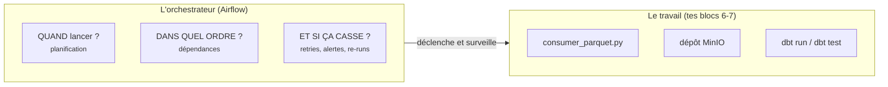
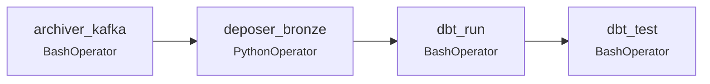
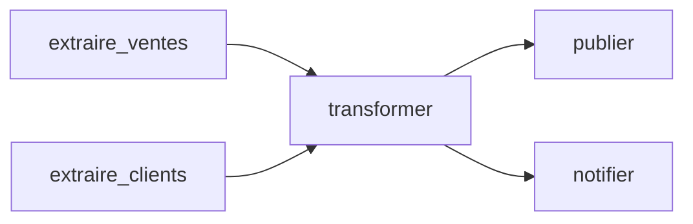
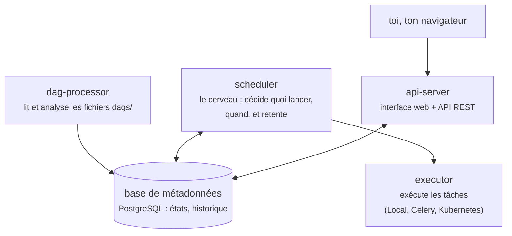
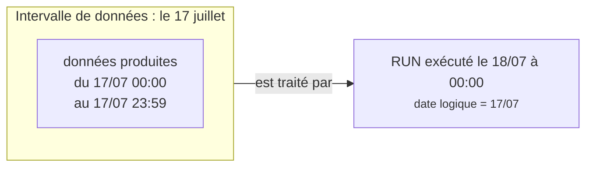
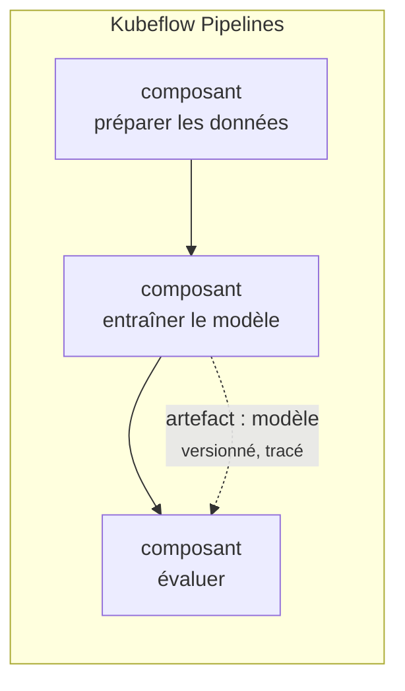

# Bloc 9 : Orchestration avec Airflow (et aperçu Kubeflow)

Au bloc 8, deux questions sont restées ouvertes : *qui* lance les étapes du
pipeline dans le bon ordre, chaque jour, sans humain ? Et *qui* réessaie,
alerte, et permet de rejouer le passé ? La réponse est l'**orchestrateur**,
et l'orchestrateur de référence du monde data est **Apache Airflow**. Dans
ce bloc, tu vas le comprendre en profondeur puis lui confier ton pipeline
des blocs 6-7, du topic Kafka jusqu'aux tests dbt.

## 1. Pourquoi un orchestrateur ? (ou : pourquoi pas cron)

La tentation naturelle : une ligne de cron.

```
0 6 * * *  /home/moi/pipeline.sh
```

Ça fonctionne... jusqu'à la première vraie question :

| Besoin | cron | Orchestrateur |
|---|---|---|
| Lancer à heure fixe | oui | oui |
| Enchaîner des étapes **dans l'ordre**, s'arrêter si l'une échoue | script fragile à écrire soi-même | natif : le DAG |
| Réessayer 2 fois avec délai en cas d'échec | à coder soi-même | `retries: 2` |
| Voir l'historique : quel jour a échoué, à quelle étape, avec quels logs | grep dans des fichiers éparpillés | interface web, tout est tracé |
| Rejouer uniquement la journée de mercredi | impossible proprement | un clic (re-run) |
| Recalculer 3 semaines après un correctif | boucle bash périlleuse | backfill natif |
| Être prévenu quand ça casse | silence | callbacks, alertes |

L'orchestrateur n'exécute pas le travail à ta place : il **décide, surveille
et retente**. Le travail reste dans tes scripts et ton SQL. C'est une pure
séparation des responsabilités :



## 2. Le DAG : la phrase fondamentale d'Airflow

**DAG** signifie *Directed Acyclic Graph* : un graphe **orienté** (les
flèches ont un sens : l'amont précède l'aval) et **acyclique** (aucun
chemin ne revient sur ses pas : sinon, qui commencerait ?). Chaque nœud est
une **tâche**, chaque flèche une **dépendance** :



Trois notions précises à distinguer :

- La **tâche** (*task*) : un nœud du graphe, l'unité d'exécution, de retry
  et de log. Règle de découpage : une tâche = une étape qu'on voudrait
  pouvoir **rejouer seule**.
- L'**operator** : le *type* d'une tâche, sa façon de travailler.
  `BashOperator` exécute une commande, `PythonOperator` une fonction ;
  il en existe des centaines (SQL, Kubernetes, Spark, transferts cloud...)
  fournis par les *providers*.
- La **dépendance** : déclarée avec l'opérateur `>>`. Chez nous, une seule
  ligne dessine tout le graphe :

```python
archiver_kafka >> bronze >> dbt_run >> dbt_test
```

Un DAG n'est pas obligé d'être une ligne droite. Des branches parallèles
sont naturelles, et Airflow les exécute en parallèle dès que possible :



Enfin, le DAG est **du code Python** (un simple fichier dans `dags/`).
Conséquences : versionné dans Git, revu en pull request, testable, et
généré dynamiquement si besoin. La boucle du parcours se boucle : ton
infrastructure (bloc 5), tes transformations (bloc 7) et maintenant ton
orchestration sont toutes du code.

## 3. L'architecture d'Airflow

Airflow n'est pas un programme mais une petite constellation. La version 3
compte quatre composants et une base de données :



- Le **dag-processor** lit les fichiers Python du dossier `dags/` en boucle
  et enregistre leur structure en base. C'est lui qui signale les erreurs
  d'import.
- Le **scheduler** est le cerveau : il compare l'heure, les dépendances et
  les états, puis met les tâches prêtes en file d'exécution. C'est aussi lui
  qui programme les retries.
- L'**executor** est la stratégie d'exécution : `LocalExecutor` (les tâches
  tournent à côté du scheduler : notre cas, parfait en lab),
  `CeleryExecutor` (une flotte de workers) ou `KubernetesExecutor` (un pod
  par tâche : c'est ainsi qu'Airflow tourne sur le cluster kind d'un vrai
  déploiement, et le pont avec ton bloc 3).
- L'**api-server** sert l'interface web et l'API REST.
- La **base de métadonnées** (PostgreSQL) est la source de vérité : chaque
  état de chaque tâche de chaque run y est tracé. Remarque : les *données*
  du pipeline n'y transitent jamais, Airflow n'orchestre que des états.

## 4. Le temps dans Airflow : la notion la plus piégeuse

Voici LE concept qui déroute tous les débutants, à lire deux fois.

Un run planifié ne porte pas la date du moment où il s'exécute, mais la
**date logique** (*logical date*) de l'**intervalle de données** qu'il
traite. Le run quotidien qui s'exécute le 18 juillet à 00h00 traite les
données **du 17 juillet** : sa date logique est le 17.



Pourquoi ce choix ? Parce qu'un traitement quotidien ne peut traiter la
journée J que lorsqu'elle est **finie**, donc à J+1. La date logique nomme
les données, pas l'horloge. C'est ce qui rend les backfills sains : rejouer
« le run du 17 » a un sens précis, quel que soit le jour où tu le rejoues.

Deux mécanismes en découlent :

- **catchup** : si le DAG a une `start_date` au 14 juillet et qu'on
  l'active le 18, doit-il exécuter les runs manqués (14, 15, 16, 17) ?
  `catchup=True` les rejoue tous ; `catchup=False` (notre choix, et le
  défaut d'Airflow 3) ne lance que le plus récent.
- **backfill** : la commande explicite pour recalculer une plage du passé,
  celle du bloc 8 :

```bash
podman exec -e HOME=/home/airflow airflow-scheduler \
  airflow backfill create --dag-id pipeline_commandes \
  --from-date 2026-07-14 --to-date 2026-07-17
```

Chaque jour de la plage devient un run avec sa date logique, exécuté avec le
code d'aujourd'hui. Ça ne fonctionne sans dégât que si les tâches sont
idempotentes, d'où la section suivante.

## 5. Des tâches robustes : idempotence, retries, alertes

### Idempotence, encore et toujours

Airflow **va** rejouer tes tâches : sur retry, sur re-run manuel, sur
backfill. Une tâche doit donc pouvoir s'exécuter deux fois sans doubler ni
corrompre. Vérifie-le sur chacune des nôtres :

| Tâche | Pourquoi rejouable sans dégât |
|---|---|
| `archiver_kafka` | reprend à l'offset commité ; les évènements déjà archivés ne sont pas relus |
| `deposer_bronze` | ré-écrire le même objet au même chemin ne crée rien de nouveau |
| `dbt_run` | reconstruit les tables à l'identique depuis le bronze (et la dédup absorbe les doublons) |
| `dbt_test` | ne fait que lire |

### Retries : l'échec est un état normal

```python
default_args={
    "retries": 2,                          # 2 nouvelles tentatives
    "retry_delay": timedelta(minutes=1),   # espacées d'une minute
}
```

La plupart des échecs réels sont **transitoires** : réseau qui cligne,
service qui redémarre, verrou temporaire. Deux retries espacés absorbent
tout cela sans réveiller personne. Dans l'interface, une tâche en retry
passe orange (`up_for_retry`) avant de réussir ou d'échouer pour de bon :
l'historique garde chaque tentative et ses logs.

### Alerting : échouer bruyamment

Le bloc 8 l'a posé en règle d'or : un pipeline qui échoue en silence est
pire qu'un pipeline en panne. Airflow fournit les crochets :
`on_failure_callback` (appeler une fonction quand une tâche échoue :
Slack, mail...), et les **deadlines** (alerter si un run n'est pas terminé
à telle heure, même sans échec : « les données doivent être prêtes à 8h »).
Au bloc 10, Prometheus scrutera les métriques d'Airflow pour la même raison.

## 6. Connections et Variables : sortir les secrets du code

Nos tâches lisent l'adresse de Kafka et de MinIO dans des variables
d'environnement : simple et suffisant en lab. Airflow offre un cran
au-dessus :

- Les **Connections** : des identifiants nommés (hôte, port, login, mot de
  passe), stockés chiffrés en base et gérés dans l'UI (menu Admin →
  Connections). Le code ne référence que l'identifiant
  (`conn_id="mon_postgres"`), les secrets ne sont **jamais** dans le DAG ni
  dans Git : même philosophie que les secrets Gitea du bloc 4.
- Les **Variables** : des paires clé-valeur de configuration (un chemin, un
  seuil, un drapeau) modifiables sans redéployer le code.

En production, les deux se branchent souvent sur un coffre externe
(Vault, AWS Secrets Manager) via un *secrets backend*.

## 7. La stack du bloc

Les fichiers sont dans
[`infra/airflow/`](https://github.com/menraromial/tuto-infra/tree/main/infra/airflow) :
un `Containerfile` qui enrichit l'image officielle avec les bibliothèques de
NOS tâches (confluent-kafka, pyarrow, dbt-duckdb, minio), et un
`compose.yaml` qui reproduit l'architecture de la section 3 : `airflow-db`
(PostgreSQL), `airflow-init` (migration, puis s'arrête), `airflow-apiserver`,
`airflow-scheduler` et `airflow-dag-processor`.

Points remarquables du compose, à lire dans le fichier :

- L'ancre YAML `x-airflow-common` factorise l'image, l'environnement et les
  volumes communs à tous les composants.
- Le **scheduler est attaché aux réseaux `ingestion` et `lake`** : avec
  `LocalExecutor`, c'est dans son conteneur que les tâches s'exécutent, et
  elles doivent joindre `redpanda:9092` et `minio:9000` (les listeners
  internes des blocs 6-7).
- `user: "0:0"` : en Podman rootless, root dans le conteneur = ton
  utilisateur sur l'hôte, donc les fichiers écrits dans les volumes montés
  (Parquet, warehouse) t'appartiennent.
- L'UI est **sans login** (`SIMPLE_AUTH_MANAGER_ALL_ADMINS: "true"`) :
  acceptable seul sur ta machine, jamais ailleurs.

```bash
# Prérequis : les stacks des blocs 6 et 7 doivent tourner
cd infra/ingestion && podman compose up -d && cd ../lake && podman compose up -d

# Construire l'image puis démarrer Airflow
podman build -t localhost/tuto-airflow:bloc9 infra/airflow/
cd infra/airflow && podman compose up -d
podman ps --filter label=com.docker.compose.project=airflow
# airflow-init doit finir en "Exited (0)", l'apiserver en "(healthy)"
```

## 8. L'interface web d'Airflow : http://localhost:8093

Aucun identifiant demandé (voir plus haut). Les vues à connaître :

- **Accueil (Dags)** : la liste des DAGs avec l'interrupteur pause/actif à
  gauche : un DAG en pause ne se planifie pas.
- **Le DAG → vue Grid** : l'historique. Chaque **colonne** est un run,
  chaque **case** une tâche : vert = succès, rouge = échec, orange = retry
  en attente. C'est la vue de garde du data engineer chaque matin.
- **Vue Graph** : le graphe des dépendances, animé pendant un run : tu vois
  l'exécution avancer de gauche à droite.
- **Une tâche → Logs** : la sortie complète de la commande, tentative par
  tentative. Ton premier réflexe de débogage.
- **Le bouton « Trigger »** (▶) : lancer un run manuel.
- **Admin → Connections / Variables** : la section 6 en pratique.

## Exercice final : le pipeline des blocs 6-7 sous orchestration

Le DAG est dans
[`exercices/bloc9/dags/pipeline_commandes.py`](https://github.com/menraromial/tuto-infra/blob/main/exercices/bloc9/dags/pipeline_commandes.py) :
lis-le en entier, il reprend exactement les notions du cours (`schedule`,
`start_date`, `catchup`, `default_args` avec retries, `doc_md`, et la ligne
des dépendances).

### 1. Simuler la journée d'activité

En production, les évènements arrivent en continu. Simule une journée :

```bash
cd exercices/bloc6
.venv/bin/python producer.py --nombre 300
```

Note l'état du warehouse avant orchestration :

```bash
cd ../bloc7 && duckdb warehouse.duckdb -c "SELECT count(*) FROM fct_commandes;"
# 500
```

### 2. Activer et déclencher

Dans l'UI : active le DAG (interrupteur), puis « Trigger ». En CLI :

```bash
podman exec -e HOME=/home/airflow airflow-scheduler \
  airflow dags unpause pipeline_commandes
podman exec -e HOME=/home/airflow airflow-scheduler \
  airflow dags trigger pipeline_commandes
```

(Le `-e HOME=/home/airflow` est expliqué au dépannage : sans lui, l'exec ne
trouve pas l'installation d'Airflow.)

Ouvre la vue **Graph** et regarde les quatre tâches passer au vert l'une
après l'autre. Va lire les logs de `dbt_run` : la sortie dbt complète y est.

### 3. Constater le résultat

```bash
duckdb exercices/bloc7/warehouse.duckdb -c "SELECT count(*) FROM fct_commandes;"
# 800   (500 + les 300 de la journée)
```

La chaîne complète (consommer Kafka → déposer le bronze → reconstruire
l'étoile → 14 tests) s'est exécutée **sans une seule commande manuelle**
entre les étapes.

### 4. Prouver l'idempotence du DAG entier

Déclenche un second run immédiatement, sans produire de nouveaux
évènements : tout doit finir vert, et le warehouse doit rester à 800
(le consumer ne relit rien, le dépôt ré-écrit les mêmes objets, dbt
reconstruit à l'identique). Un DAG qu'on peut déclencher « pour rien » sans
danger est un DAG sain : c'est exactement ce qui rend re-runs et backfills
sereins.

**Critères de réussite** : les deux runs entièrement verts dans la vue
Grid ; 800 faits après le premier run et toujours 800 après le second ; tu
sais expliquer la date logique d'un run et pourquoi chaque tâche est
idempotente.

## 9. Aperçu : Kubeflow Pipelines, l'orchestration côté ML

Sur Kubernetes (ton bloc 3), le monde du machine learning a son
orchestrateur dédié : **Kubeflow Pipelines**. Les concepts se
correspondent, avec un accent différent :



- Le **composant** est l'équivalent de la tâche, mais chaque composant
  tourne dans **son propre conteneur** sur le cluster (image, CPU/GPU et
  mémoire dédiées).
- Les **artefacts** (jeux de données, modèles, métriques) sont des sorties
  **typées et versionnées**, tracées entre composants : le lineage est au
  centre, car reproduire un entraînement est une exigence ML.
- Les **expériences** regroupent les exécutions pour comparer les
  résultats (précision du modèle v12 contre v13).

| Critère | Airflow | Kubeflow Pipelines |
|---|---|---|
| Domaine | pipelines de données généralistes | workflows de machine learning |
| Unité | tâche (operator) | composant conteneurisé |
| Ce qui circule | des états (les données restent dehors) | des artefacts versionnés |
| Infrastructure | où tu veux | Kubernetes obligatoire |
| Choisis-le si... | ELT, ingestion, reporting planifiés | entraînements reproductibles, GPU, comparaisons d'expériences |

Beaucoup d'équipes utilisent les deux : Airflow orchestre la plateforme
data, et déclenche un pipeline Kubeflow quand un modèle doit être
ré-entraîné. L'installer demande un cluster musclé (8 Go de RAM rien que
pour lui) : garde les concepts, et installe-le le jour où le besoin ML est
réel.

## Dépannage

??? failure "`podman exec ... airflow` : `ModuleNotFoundError: No module named 'airflow'`"
    Airflow est installé dans le home de l'utilisateur `airflow` de l'image,
    et `podman exec` démarre sans ce HOME (nos conteneurs tournent en
    `user: "0:0"`). Ajoute toujours `-e HOME=/home/airflow` aux commandes
    `podman exec ... airflow ...`.

??? failure "Le DAG n'apparaît pas dans l'UI"
    - Attends ~30 s : le dag-processor scanne périodiquement.
    - Erreur d'import ? `podman exec -e HOME=/home/airflow airflow-scheduler airflow dags
      list-import-errors` : un DAG qui ne s'importe pas n'existe pas.
    - Le fichier est-il bien monté ?
      `podman exec airflow-dag-processor ls /opt/airflow/dags/`

??? failure "`archiver_kafka` échoue : broker injoignable"
    La stack ingestion tourne-t-elle ? Le scheduler est-il attaché au réseau
    `ingestion_default` (section networks du compose) ? Depuis Airflow c'est
    `redpanda:9092` (listener interne), jamais `localhost:19092`.

??? failure "`dbt_run` échoue : `Conflicting lock` sur warehouse.duckdb"
    Un CLI `duckdb` est resté ouvert sur le fichier côté hôte : DuckDB
    n'accepte qu'un écrivain. Ferme-le et relance la tâche (bouton
    « Clear » sur la tâche : Airflow la rejouera).

??? failure "Les tâches restent en `queued` sans démarrer"
    Regarde les logs du scheduler : `podman logs airflow-scheduler`.
    Cause fréquente en lab : la machine manque de RAM et le scheduler
    rame ; ferme quelques stacks (`podman compose down` dans les dossiers
    inutilisés).

??? failure "L'UI demande un login"
    La variable `AIRFLOW__CORE__SIMPLE_AUTH_MANAGER_ALL_ADMINS` doit valoir
    `"true"` dans le compose. Après modification :
    `podman compose up -d` pour recréer les conteneurs.

??? failure "Permission refusée sur data/ ou warehouse.duckdb"
    Les conteneurs doivent tourner avec `user: "0:0"` (voir compose) pour
    qu'en rootless les fichiers créés appartiennent à ton utilisateur.
    Si des fichiers ont déjà de mauvais droits : `podman unshare chown -R
    0:0 exercices/bloc6/data` les remet à ton nom.
